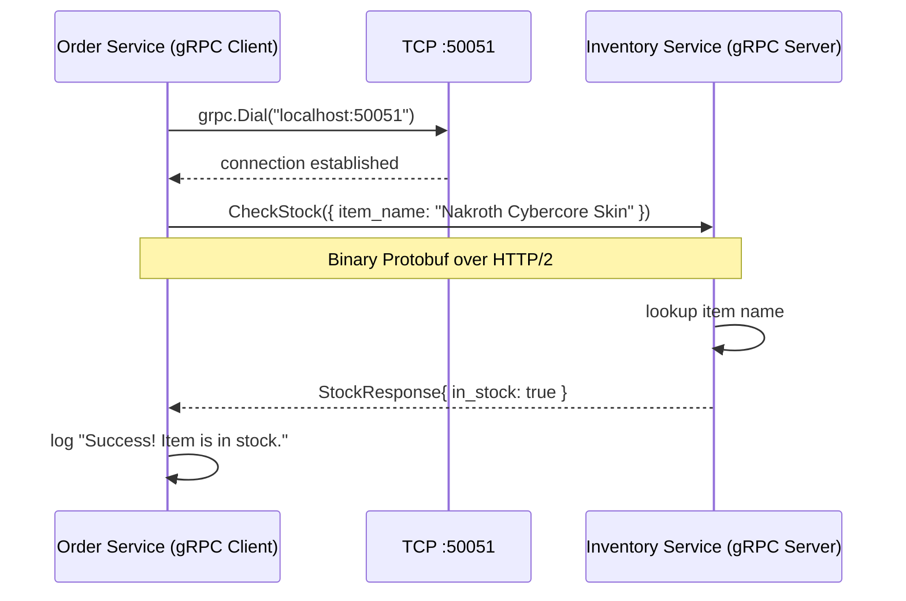

### **Day 5: Implementing gRPC in Go**

Today we replace the HTTP/REST communication from Day 3 with a high-speed gRPC setup.

Create a new folder called `day5-grpc`. Inside, you need a shared `pb` folder, an `inventory` folder, and an `order` folder.

#### **1. Generating the Go Code from Protobuf**

In your `day5-grpc` folder, create `store.proto`:

```protobuf
syntax = "proto3";

option go_package = "./pb";

package store;

message StockRequest {
  string item_name = 1;
}

message StockResponse {
  bool in_stock = 1;
}

service InventoryService {
  rpc CheckStock (StockRequest) returns (StockResponse);
}
```

Run this command to generate Go code:

```bash
protoc --go_out=. --go-grpc_out=. store.proto
```

A `pb` folder will appear with `store.pb.go` and `store_grpc.pb.go`. **Never edit these files manually** — they are the shared contract.

#### **2. The Inventory Service (gRPC Server)**

In `inventory/main.go`:

```go
package main

import (
	"context"
	"log"
	"net"

	"day5-grpc/pb"
	"google.golang.org/grpc"
)

type server struct {
	pb.UnimplementedInventoryServiceServer
}

func (s *server) CheckStock(ctx context.Context, req *pb.StockRequest) (*pb.StockResponse, error) {
	log.Printf("Received check for: %s", req.GetItemName())

	inStock := false
	if req.GetItemName() == "Nakroth Cybercore Skin" {
		inStock = true
	}

	return &pb.StockResponse{InStock: inStock}, nil
}

func main() {
	lis, err := net.Listen("tcp", ":50051")
	if err != nil {
		log.Fatalf("failed to listen: %v", err)
	}

	s := grpc.NewServer()
	pb.RegisterInventoryServiceServer(s, &server{})
	log.Printf("gRPC Inventory Server listening at %v", lis.Addr())

	if err := s.Serve(lis); err != nil {
		log.Fatalf("failed to serve: %v", err)
	}
}
```

#### **3. The Order Service (gRPC Client)**

In `order/main.go`:

```go
package main

import (
	"context"
	"log"
	"time"

	"day5-grpc/pb"
	"google.golang.org/grpc"
	"google.golang.org/grpc/credentials/insecure"
)

func main() {
	conn, err := grpc.Dial("localhost:50051", grpc.WithTransportCredentials(insecure.NewCredentials()))
	if err != nil {
		log.Fatalf("did not connect: %v", err)
	}
	defer conn.Close()

	client := pb.NewInventoryServiceClient(conn)

	ctx, cancel := context.WithTimeout(context.Background(), time.Second)
	defer cancel()

	item := "Nakroth Cybercore Skin"
	log.Printf("Attempting to order: %s", item)

	// THIS IS THE MAGIC — looks like a local function call, but it's a network request
	r, err := client.CheckStock(ctx, &pb.StockRequest{ItemName: item})
	if err != nil {
		log.Fatalf("could not check stock: %v", err)
	}

	if r.GetInStock() {
		log.Println("Success! Item is in stock. Proceeding with order.")
	} else {
		log.Println("Failed. Item is out of stock.")
	}
}
```



---

### **Actionable Task for Today**

1. Initialize the Go module: `go mod init day5-grpc` then `go mod tidy`.
2. Open two terminals.
3. Terminal 1: `go run inventory/main.go`
4. Terminal 2: `go run order/main.go`
5. Change the `item` string to something else and watch it fail the stock check.

---

### **Day 5 Revision Question**

Look at this line in the Order Service:

```go
ctx, cancel := context.WithTimeout(context.Background(), time.Second)
```

If the Inventory Service takes 3 seconds to respond, what happens to the Order Service? Why is including a timeout on every synchronous call critical?

**Answer:** The Order Service aborts the request after 1 second and returns an error. The Inventory Service may continue processing in the background (wasting CPU and database connections), but the Order Service has already moved on. This is exactly how we prevent **cascading failures** — a slow downstream service doesn't drag the entire system down with it.

### **How Go Context Translates to Python in gRPC**

Go's `context.Context` is a Go-specific concept — you cannot send a Go object over the network to a Python server.

Here is what actually happens under the hood:

1. **Translation:** When your Go client calls `CheckStock` with a 1-second timeout context, the gRPC library intercepts it, calculates the remaining time, and attaches a special HTTP/2 header called `grpc-timeout`.
2. **Over the wire:** The binary Protobuf payload and the `grpc-timeout` header travel to the Python server.
3. **Python side:** The Python gRPC library reads the `grpc-timeout` header and generates a `grpc.ServicerContext` object, passing it into your function.

```python
def CheckStock(self, request, context):
    time_left = context.time_remaining()

    if not context.is_active():
        return  # Client already cancelled — stop processing
```

gRPC perfectly translates the _meaning_ of the context (timeout, cancellation signals, metadata) between different programming languages using HTTP/2 headers as the transport layer.
