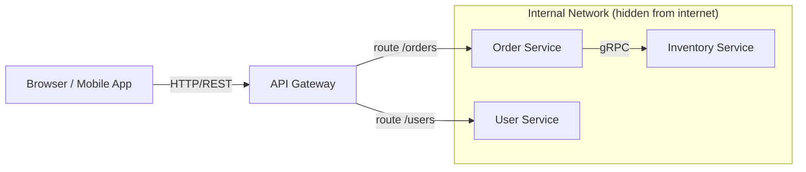
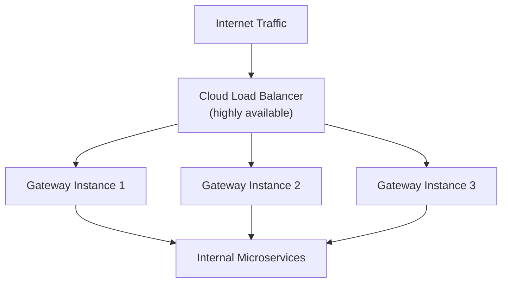

### **Day 6: API Gateways**

So far, the Order Service talks to the Inventory Service. But how does a browser or mobile app talk to the Order Service? Browsers don't do native gRPC, and you don't want to expose internal microservices directly to the public internet.

#### **1. What is an API Gateway?**

An API Gateway is the single entry point into your system. It sits between your users and your microservices — essentially a "reverse proxy" with superpowers.

#### **2. Why Do We Need It?**

- **Protocol Translation:** The Gateway accepts standard HTTP/REST/JSON from browsers and translates them into lightning-fast gRPC/Protobuf calls to internal services.
- **Routing:** Routes `api.myapp.com/orders` to the Order Service and `api.myapp.com/users` to the User Service.
- **Authentication:** Instead of putting JWT validation in every single microservice, you validate the token once at the Gateway. If it's fake, the request is rejected before it ever touches the internal network.
- **Rate Limiting:** Block DDoS attacks and abusive users at the front door.

#### **3. Popular API Gateways**

You rarely write an API Gateway from scratch:

- **Kong:** Extremely popular, built on NGINX/Lua, highly performant.
- **Envoy:** The modern cloud-native standard (also used as a sidecar in service meshes).
- **KrakenD:** Written in Go, fast, easy to configure for REST-to-REST or REST-to-gRPC.
- **Cloud Managed:** AWS API Gateway, Google Cloud API Gateway.

---

### **Actionable Task for Today**

Draw the architecture you will build tomorrow:

1. **Client (Browser/Postman)** sends `GET /api/checkout`.
2. **API Gateway** (Port 8000) receives it.
3. **Order Service** (Port 8081) receives the routed request and acts as a gRPC client.
4. **Inventory Service** (Port 50051) receives the gRPC call and returns a boolean.
5. Response travels back up the chain to the user.

For tomorrow's code, we will write a simple custom Go gateway to deeply understand routing, rather than using a heavy tool like Kong right away.

---

### **Day 6 Revision Question**

By routing all traffic through a single Gateway, we have hidden the internal network, centralized authentication, and enabled protocol translation.

**However — what is the most obvious architectural risk we just introduced by funneling all traffic through this single point?**

**Answer:** **Single Point of Failure (SPOF).** If the Gateway goes down, it doesn't matter how many perfectly healthy microservices sit behind it — the entire application is offline to the outside world.

**How the real world fixes this:** Run multiple instances of the API Gateway and put a highly available Cloud Load Balancer in front of them. If one Gateway container crashes, the Load Balancer routes traffic to the remaining healthy instances.

