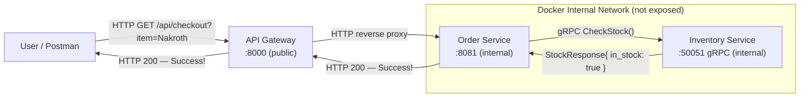

### **Day 7: Week 1 Consolidation Project**

Today we put all the pieces together — a fully functional 3-tier synchronous microservice architecture using Go and Docker Compose.

#### **The Architecture**



**Request flow:**
1. User sends `GET http://localhost:8000/api/checkout?item=Nakroth`
2. **API Gateway** (port 8000) reverse-proxies the HTTP request to the Order Service.
3. **Order Service** (port 8081) receives the HTTP request, then acts as a gRPC client calling the Inventory Service.
4. **Inventory Service** (port 50051) checks its "database" and returns a boolean.
5. The response travels back up the chain to the user.

#### **1. Project Setup**

```text
week1-final/
├── docker-compose.yml
├── pb/               # Generated store.pb.go and store_grpc.pb.go
├── inventory/        # Day 5 gRPC Server + Dockerfile
├── order/            # HTTP Server + gRPC Client + Dockerfile
└── gateway/          # API Gateway + Dockerfile
```

#### **2. The Order Service (The Middleman)**

This service listens for HTTP from the Gateway but speaks gRPC to the Inventory Service.

In `order/main.go`:

```go
package main

import (
	"context"
	"fmt"
	"log"
	"net/http"
	"time"

	"week1-final/pb"
	"google.golang.org/grpc"
	"google.golang.org/grpc/credentials/insecure"
)

var inventoryClient pb.InventoryServiceClient

func checkoutHandler(w http.ResponseWriter, r *http.Request) {
	item := r.URL.Query().Get("item")
	if item == "" {
		http.Error(w, "Missing 'item' parameter", http.StatusBadRequest)
		return
	}

	log.Printf("Processing checkout for: %s", item)

	ctx, cancel := context.WithTimeout(context.Background(), 2*time.Second)
	defer cancel()

	resp, err := inventoryClient.CheckStock(ctx, &pb.StockRequest{ItemName: item})
	if err != nil {
		http.Error(w, "Failed to check inventory", http.StatusServiceUnavailable)
		return
	}

	if resp.GetInStock() {
		w.Write([]byte(fmt.Sprintf("Success! %s is ordered.\n", item)))
	} else {
		w.Write([]byte(fmt.Sprintf("Sorry, %s is out of stock.\n", item)))
	}
}

func main() {
	// Docker resolves the container name "inventory" to its internal IP
	conn, err := grpc.Dial("inventory:50051", grpc.WithTransportCredentials(insecure.NewCredentials()))
	if err != nil {
		log.Fatalf("Failed to dial inventory service: %v", err)
	}
	defer conn.Close()

	inventoryClient = pb.NewInventoryServiceClient(conn)

	http.HandleFunc("/api/checkout", checkoutHandler)
	log.Println("Order Service listening for HTTP on :8081")
	log.Fatal(http.ListenAndServe(":8081", nil))
}
```

#### **3. The API Gateway**

A simple Go reverse proxy that intercepts traffic on port 8000 and forwards it to the Order Service.

In `gateway/main.go`:

```go
package main

import (
	"log"
	"net/http"
	"net/http/httputil"
	"net/url"
)

func main() {
	orderServiceURL, err := url.Parse("http://order:8081")
	if err != nil {
		log.Fatal(err)
	}

	proxy := httputil.NewSingleHostReverseProxy(orderServiceURL)

	http.HandleFunc("/api/checkout", func(w http.ResponseWriter, r *http.Request) {
		log.Printf("Gateway routing request for: %s", r.URL.Path)
		proxy.ServeHTTP(w, r)
	})

	log.Println("API Gateway listening on public port :8000")
	log.Fatal(http.ListenAndServe(":8000", nil))
}
```

#### **4. The Docker Compose Glue**

```yaml
version: "3.8"
services:
  inventory:
    build: ./inventory
    # NOT exposed to the host machine — completely hidden

  order:
    build: ./order
    depends_on:
      - inventory
    # NOT exposed to the host machine

  gateway:
    build: ./gateway
    ports:
      - "8000:8000" # ONLY the Gateway is visible to the outside world
    depends_on:
      - order
```

---

### **Actionable Task for Today**

1. Build the structure and write the Dockerfiles (reuse them from Day 3).
2. Run `docker-compose up --build`.
3. Test: `http://localhost:8000/api/checkout?item=Nakroth%20Cybercore%20Skin` → should succeed.
4. Test: `http://localhost:8000/api/checkout?item=Random%20Sword` → should fail.

Notice you **cannot** access the Order or Inventory services directly from your browser. The Gateway is the only open door.

---

### **End of Week 1 Review & Question**

Congratulations on finishing Week 1. You have built a real, functioning microservice cluster using both REST and gRPC, hidden securely behind a Gateway.

**Review Question to kick off Week 2:**

In our current project, if 100,000 users try to buy the Nakroth skin at the exact same millisecond, the Gateway passes 100,000 HTTP requests to the Order Service, which opens 100,000 gRPC connections to the Inventory Service.

**Based on Day 2, what is going to happen to our system? What specific tool will we introduce in Week 2 to fix it?**

**Answer:** The bottleneck just moves downstream. The Order Service opens 100,000 gRPC connections to the Inventory Service, which tries to execute 100,000 database queries simultaneously. The database crashes, the Inventory Service goes down, and users get errors.

To fix this, we introduce a **Message Broker** (like RabbitMQ or Kafka) as a shock absorber.

Welcome to Week 2.
