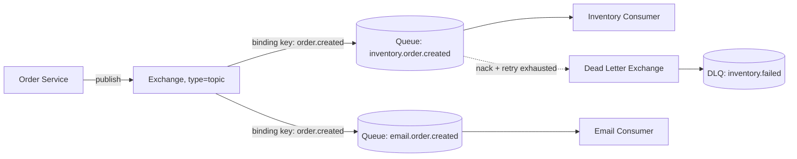
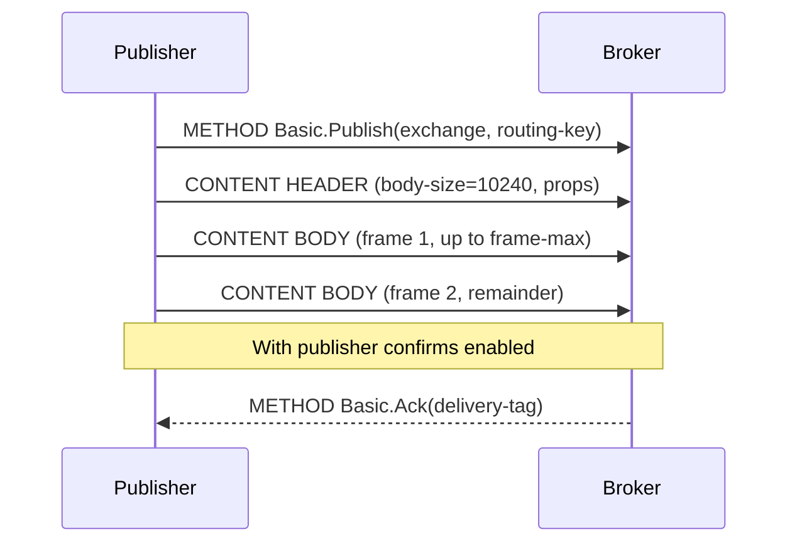
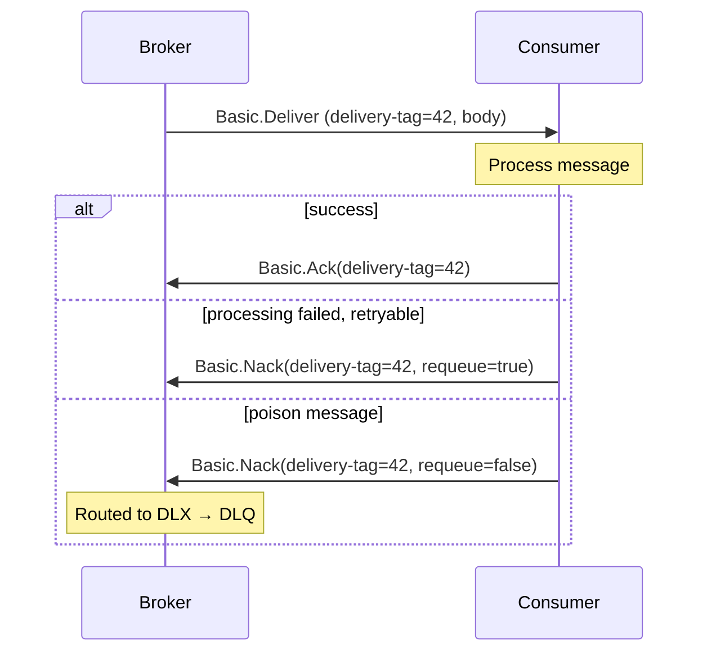
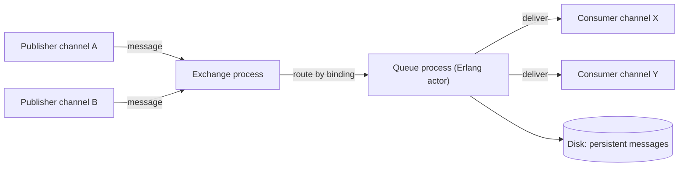
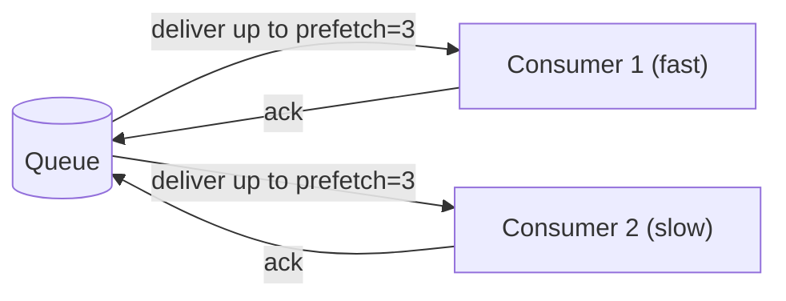
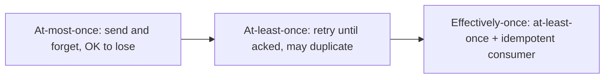
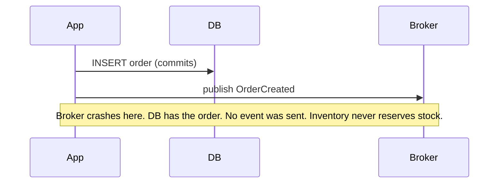

# Week 2 — Asynchronous Communication & Message Queues, Deep Intro

[Back to top README](../../README.md)

## TL;DR

- **What you learn:** how producers hand work to a broker so consumers process it later, decoupled in time.
- **Tools:** RabbitMQ (AMQP 0-9-1), AWS SQS / SNS via LocalStack.
- **Mental model:** the broker is the **shock absorber** between fast producers and slow consumers. Delivery is at-least-once by default — design for duplicates.

---

## Architecture at a glance



The producer no longer knows who consumes the message, or how many do. Add a third consumer tomorrow — bind another queue to the same exchange. The producer's code does not change.

---

## Protocol / byte level

### AMQP 0-9-1 frame anatomy

Every byte AMQP puts on the wire is one of four frame types:

```text
| 1B type | 2B channel | 4B payload-size | payload... | 1B 0xCE end-marker |

type = 1  METHOD          // Channel.Open, Basic.Publish, Basic.Ack...
type = 2  CONTENT HEADER  // body size + properties (content-type, headers, delivery-mode)
type = 3  CONTENT BODY    // raw message bytes (split if > frame-max)
type = 8  HEARTBEAT       // keep-alive
```

A single `basic.publish` of a 10 KB message becomes:



- **Channels** multiplex many logical connections over one TCP connection (very similar to HTTP/2 streams). Open one channel per goroutine.
- **Publisher confirms** turn fire-and-forget into reliable publish: the broker only acks once the message is safely enqueued (and persisted, for durable queues).

### Consumer ack flow



Without `ack`, the broker assumes the consumer crashed and redelivers the message after the channel closes — that is how at-least-once is enforced.

### SQS request shape (HTTP-based)

SQS is just an HTTPS API. A long-poll receive looks like:

```text
POST / HTTP/1.1
Host: sqs.us-east-1.amazonaws.com
X-Amz-Target: AmazonSQS.ReceiveMessage
Authorization: AWS4-HMAC-SHA256 ...
Content-Type: application/x-amz-json-1.0

{
  "QueueUrl": "https://sqs.../orders",
  "MaxNumberOfMessages": 10,
  "WaitTimeSeconds": 20,
  "VisibilityTimeout": 30
}
```

- **WaitTimeSeconds** = long polling. The connection sleeps server-side until a message arrives or the timer fires — far cheaper than busy-polling.
- **VisibilityTimeout** = the message is invisible to other consumers for N seconds. If you do not `DeleteMessage` within that window, it reappears. SQS does not have explicit acks; **delete is the ack**.

### SNS → SQS fanout envelope

SNS wraps your message in a JSON envelope before delivering to each subscribed SQS queue:

```json
{
  "Type": "Notification",
  "MessageId": "...",
  "TopicArn": "arn:aws:sns:...",
  "Message": "<your raw payload as a string>",
  "Timestamp": "...",
  "SignatureVersion": "1",
  "Signature": "...",
  "MessageAttributes": { ... }
}
```

This is why naive consumers fail in SNS+SQS setups: they call `json.Unmarshal` on the body and get the envelope, not the payload. Always unwrap `Message` first (or enable raw-message delivery).

---

## System internals

### A RabbitMQ queue is a process

In RabbitMQ (Erlang/OTP), each queue is its own lightweight process with a mailbox.



- One queue = one process = work is **serialized per queue**. To scale a hot topic, partition into many queues (`orders.shard.0`, `orders.shard.1`, ...).
- Classic mirrored queues replicate to other nodes via Erlang messaging. Quorum queues (newer, recommended) use the Raft consensus algorithm for stronger guarantees and automatic leader election.

### Prefetch + fair dispatch



- Without `basic.qos(prefetch=N)`, the broker dumps everything on the first consumer that connects (round-robin), regardless of speed.
- With prefetch, each consumer holds at most N unacked messages. The slow consumer naturally gets fewer messages. This is how you get **fair dispatch** and basic backpressure.

### SQS internals (mental model)

SQS is a managed, distributed queue. Conceptually it is a sharded log per queue with redundancy across availability zones. You don't see the shards, but they explain quirks:

- **Standard queues** = best-effort ordering, at-least-once, very high throughput. Order is not guaranteed across shards.
- **FIFO queues** = strict ordering per `MessageGroupId`, exactly-once enqueue via `MessageDeduplicationId`, but lower throughput per group.

---

## Mental models

### Delivery guarantees



- **At-most-once** = no retries; possible message loss. Fire-and-forget telemetry, ephemeral notifications.
- **At-least-once** = retries until ack; possible duplicates. The default for RabbitMQ, SQS, Kafka.
- **Exactly-once** = a marketing term; in practice you build **effectively-once** by making consumers idempotent (dedup by message ID, upsert by natural key, conditional update on a state column).

### The dual-write problem (foreshadows Week 4 Outbox)



You cannot atomically commit to both the database and the broker without a distributed transaction. Week 4's Outbox pattern is how you fix it.

### Queue depth as a SLO signal

- **Depth growing** = consumers are slower than producers → scale consumers, or apply backpressure upstream.
- **Depth oscillating around 0** = healthy.
- **Depth = 0 for hours** = either nothing is producing, or the consumer is silently failing (acking on errors).
- **Redelivery rate climbing** = poison messages → check the DLQ.

### Temporal decoupling — what you actually buy

| Property                       | Sync (Week 1)                    | Async via broker (Week 2)        |
|--------------------------------|----------------------------------|----------------------------------|
| Both sides up at the same time | Required                         | Not required                     |
| Producer learns the result     | Yes, in the response             | No, must be a separate event     |
| Backpressure                   | Implicit (callee blocks)         | Explicit (queue depth, prefetch) |
| Adding a new consumer          | New code in producer             | New binding, no producer change  |
| Worst-case latency             | Sum of hops                      | Bounded by queue depth + ack     |

---

## Failure modes

- **Producer crashes after `INSERT` before publish** — dual-write problem; events are lost. Mitigation: outbox (Week 4).
- **Consumer crashes mid-process** — broker redelivers; you may double-process. Mitigation: idempotency key + `INSERT ... ON CONFLICT`.
- **Poison message** — same message keeps failing forever, blocks the queue. Mitigation: max-redelivery + DLQ + manual triage.
- **Slow consumer / queue depth explosion** — memory pressure on broker, eventual flow control. Mitigation: autoscale consumers, prefetch tuning, lazy queues.
- **Wrong binding key** — message silently dropped by exchange. Mitigation: alternate exchange to catch unrouted messages, alarm on its depth.
- **SQS visibility timeout shorter than processing time** — same message processed twice in parallel. Mitigation: extend visibility, or use heartbeat to call `ChangeMessageVisibility` mid-flight.

---

## Day-by-day links

- [Day 8 — Event-Driven Architecture](day8-EDA.md)
- [Day 9 — Message Brokers, queues vs pub/sub](day9-messages_queues_and_brokers.md)
- [Day 10 — RabbitMQ Basics](day10-RabbitMQ_basics.md)
- [Day 11 — Exchanges & Routing (Fanout, Direct, Topic)](day11-advanced_routing.md)
- [Day 12 — Cloud Queues (SQS, SNS, fanout)](day12-cloud_native_queues.md)
- [Day 13 — Delivery guarantees & idempotency](day13-message_delivery_and_idempotency.md)
- [Day 14 — Project: Order publishes, Inventory consumes](day14-consolidation_project.md)
