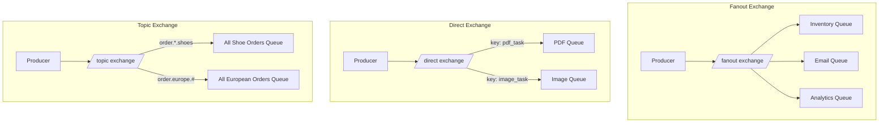

### **Day 11: Advanced Routing (Exchanges)**

Yesterday, we published directly to a Queue. In real Pub/Sub architectures, producers _never_ send messages directly to queues.

#### **1. The Exchange**

Producers only send messages to an **Exchange**. The Exchange is like a mail sorting facility — it looks at each message and decides which Queue(s) it should be copied into, based on rules called **Bindings**.

#### **2. Types of Exchanges**



- **Fanout Exchange:** Blindly copies the message to _every_ queue bound to it. Perfect for broadcasting `OrderPlaced` to Inventory, Email, and Analytics simultaneously.
- **Direct Exchange:** Routes based on an exact matching routing key. `pdf_tasks` → PDF Queue; `image_tasks` → Image Queue.
- **Topic Exchange:** Routes based on wildcard patterns. `order.europe.shoes` matches both `order.*.shoes` (all shoe orders globally) and `order.europe.#` (all European orders of any type).

---

### **Actionable Task for Today**

Modify yesterday's code to use a **Fanout Exchange**.

**1. Update the Producer (`producer/main.go`):**

Replace `QueueDeclare` with an Exchange declaration:

```go
err = ch.ExchangeDeclare(
	"logs_exchange", // name
	"fanout",        // type
	true,            // durable
	false,           // auto-deleted
	false,           // internal
	false,           // no-wait
	nil,             // arguments
)
```

Publish to the Exchange instead of a queue:

```go
err = ch.PublishWithContext(ctx,
	"logs_exchange", // exchange name
	"",              // routing key (ignored for fanout)
	// ... rest unchanged
)
```

**2. Update the Consumer (`consumer/main.go`):**

```go
// Declare the same Exchange
err = ch.ExchangeDeclare("logs_exchange", "fanout", true, false, false, false, nil)

// Declare a temporary, exclusive queue (RabbitMQ generates a random unique name)
q, err := ch.QueueDeclare("", false, false, true, false, nil)

// Bind the queue to the Exchange
err = ch.QueueBind(
	q.Name,          // queue name
	"",              // routing key (ignored for fanout)
	"logs_exchange", // exchange
	false,
	nil,
)
```

**Test:**
1. Open three terminals.
2. Run the Consumer in Terminal 1 and Terminal 2 (simulating Inventory Service and Email Service).
3. Run the Producer in Terminal 3.
4. Watch the exact same message fan out and appear in both Consumer terminals simultaneously.

---

### **Day 11 Revision Question**

You understand how to fix duplicate messages using an idempotency key in the database. But what if 5 duplicate messages hit your worker at the _exact same millisecond_? All 5 threads run `SELECT status FROM payments WHERE order_id = 999` before any of them has written `status = 'completed'` — all 5 might think the order hasn't been processed yet!

**How do you make the idempotency check bulletproof at the database level?**

**Answer: Primary Key / Unique Constraint Insert**

1. Create a table `idempotency_keys` with a single column `key_id` (String) — make it the **Primary Key** (or give it a `UNIQUE` constraint).
2. When a Payment Worker receives a message, it immediately tries: `INSERT INTO idempotency_keys (key_id) VALUES ('payment_order_999')`.

**What happens to the 5 concurrent threads:**

- **Thread 1** hits the database first → insert succeeds → charges the credit card.
- **Threads 2–5** hit milliseconds later → the database enforces the Primary Key rule → all four get a **"Unique Constraint Violation (Duplicate Key Error)"** instantly.
- Your Go code catches that specific error, says _"Another thread is already handling this,"_ skips the credit card charge, and sends `ACK` to RabbitMQ.

Bulletproof idempotency — guaranteed by the database engine itself, not your application code.
