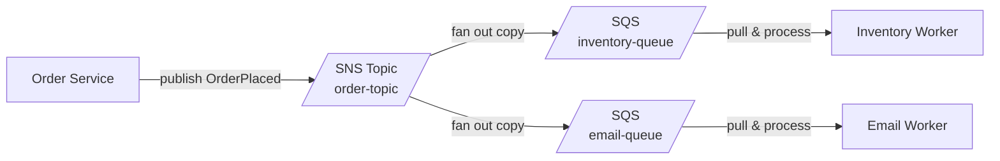
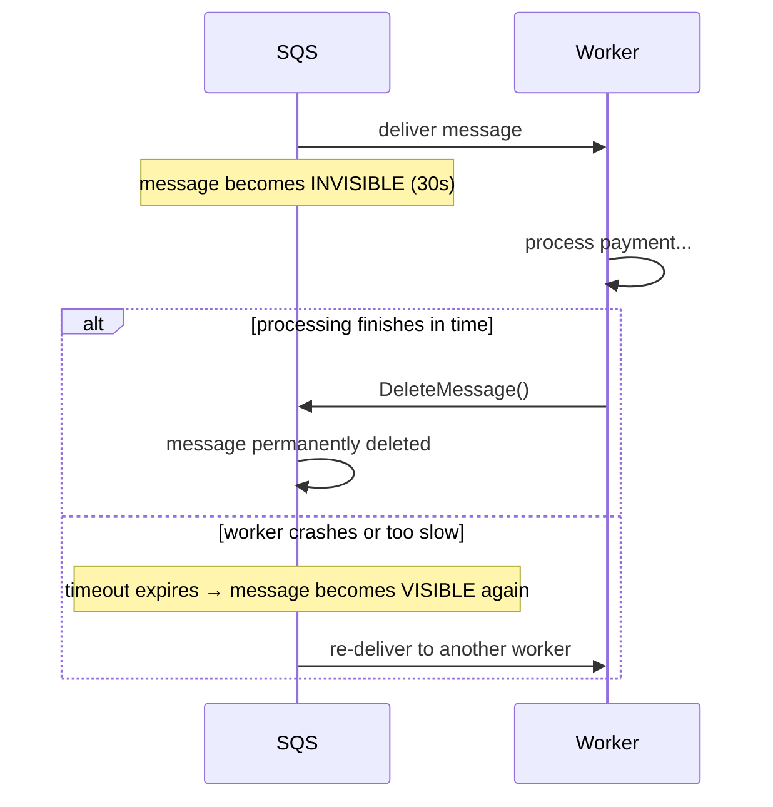

### **Day 12: Cloud-Native Queues (AWS SQS/SNS)**

Running RabbitMQ yourself is powerful, but it comes with a cost: you maintain the server, patch the OS, monitor disk space, and handle scaling. Most modern teams prefer **managed cloud services**. Today we look at the undisputed king of cloud messaging: AWS.

#### **1. SQS (Simple Queue Service)**

Amazon's fully managed message queue.

- **The Good:** No servers to manage. Infinite auto-scaling. A few cents per million messages.
- **The Bad:** Strictly **Point-to-Point**. It has no Exchanges or Pub/Sub routing. If you put a message in an SQS queue, one worker reads it and it's gone.

#### **2. SNS (Simple Notification Service)**

Because SQS can't do Pub/Sub, AWS created SNS — essentially a **Fanout Exchange**. You publish a message to an SNS "Topic" and it fans out to all subscribers.

#### **3. The SNS-to-SQS Fanout Pattern**

This is one of the most famous cloud architectural patterns — combining SNS's fanout with SQS's durable holding.



**The SQS Visibility Timeout lifecycle:**



---

### **Actionable Task for Today**

Use **LocalStack** to mimic AWS locally inside Docker — no real AWS account needed.

**1. Create `day12-aws/docker-compose.yml`:**

```yaml
version: "3.8"
services:
  localstack:
    image: localstack/localstack
    ports:
      - "4566:4566"
    environment:
      - SERVICES=sqs,sns
      - DOCKER_HOST=unix:///var/run/docker.sock
```

Run `docker-compose up -d`.

**2. Install the AWS CLI and configure with dummy credentials:**

```bash
aws configure
# AWS Access Key ID: test
# AWS Secret Access Key: test
# Default region: us-east-1
# Output format: json
```

**3. Build the SNS-to-SQS architecture via terminal:**

```bash
# Create the queues
aws --endpoint-url=http://localhost:4566 sqs create-queue --queue-name inventory-queue
aws --endpoint-url=http://localhost:4566 sqs create-queue --queue-name email-queue

# Create the SNS Topic
aws --endpoint-url=http://localhost:4566 sns create-topic --name order-topic

# Subscribe queues to the topic
aws --endpoint-url=http://localhost:4566 sns subscribe \
    --topic-arn arn:aws:sns:us-east-1:000000000000:order-topic \
    --protocol sqs \
    --notification-endpoint arn:aws:sqs:us-east-1:000000000000:inventory-queue
```

Today's focus is understanding how the cloud components link together — the Go code comes later.

---

### **Day 12 Revision Question**

SQS has a **Visibility Timeout** — when your worker pulls a message, SQS makes it invisible to all other workers for a default of 30 seconds. If the worker doesn't explicitly delete the message in that window, SQS makes it visible again.

**Why is this identical to RabbitMQ's Manual ACKs? And what terrible thing happens if your Go Payment Worker takes 45 seconds to process a credit card?**

**Answer:**

**1. What is it identical to?**
SQS's Visibility Timeout is exactly RabbitMQ's **Manual Acknowledgment**. In RabbitMQ, the message stays in the queue (marked "unacknowledged") until the worker sends `ch.Ack()`. If the worker dies before acking, RabbitMQ re-queues it. SQS does the same thing using a timer instead.

**2. What happens if processing takes 45 seconds?**
At the 30-second mark, the message becomes "visible" again. A second Payment Worker picks it up and starts charging the credit card — **double-charging your customer**.

The fix: either increase the Visibility Timeout to be safely longer than your maximum expected processing time, or have your worker periodically call SQS to extend the timeout while it's still working (`ChangeMessageVisibility`).
