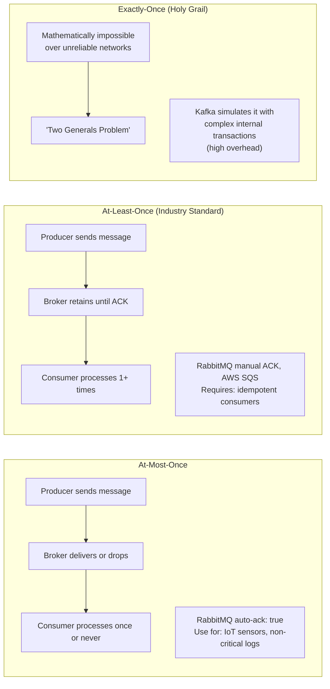
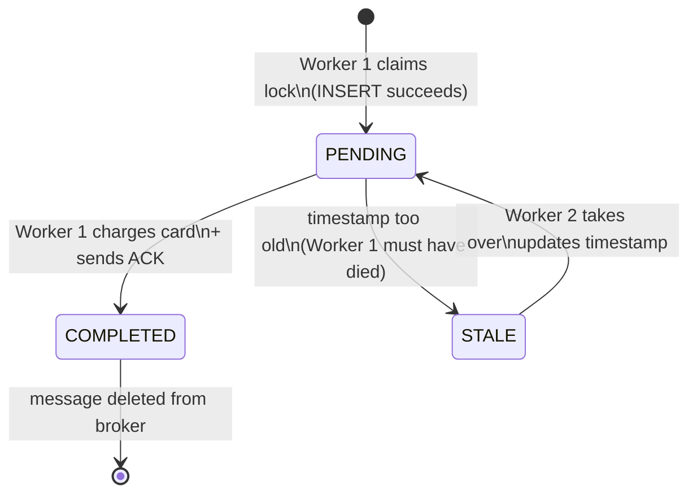

### **Day 13: Message Delivery Guarantees & Idempotency Deep Dive**

Today we formalize the chaotic nature of networks. Engineers categorize message delivery into three strict guarantees.

#### **1. The Three Delivery Guarantees**



- **At-Most-Once:** Send and forget. If the message is lost, oh well. (RabbitMQ with `auto-ack: true`.) Use for IoT sensor data, non-critical analytics.
- **At-Least-Once:** The industry standard. The system guarantees delivery, but due to network retries, the message may arrive 2, 3, or 10 times. **Requires idempotent consumers.**
- **Exactly-Once:** True exactly-once over an unreliable network is considered mathematically impossible (see the "Two Generals' Problem"). Some systems like Kafka simulate it using internal transactions, but at significant overhead cost.

#### **2. The Anatomy of an Idempotent Consumer**

Every async worker you write should follow this exact pattern:

```go
func processPaymentMessage(msg []byte) {
    // 1. Extract the unique Idempotency Key
    orderID := extractOrderID(msg)

    // 2. Try to claim the lock via UNIQUE INSERT
    err := db.Exec("INSERT INTO processed_events (event_id) VALUES (?)", orderID)

    if err != nil {
        if isUniqueConstraintViolation(err) {
            // WE ARE IDEMPOTENT — another worker already did this
            log.Println("Duplicate message detected. Skipping.")
            acknowledgeMessage(msg)
            return
        }
        // Real DB error — do NOT acknowledge, let it retry
        return
    }

    // 3. Lock claimed — do the actual work
    chargeCreditCard()

    // 4. Acknowledge so the broker deletes the message
    acknowledgeMessage(msg)
}
```

---

### **Actionable Task for Today**

No new Docker containers today. Review the code snippet above and map it to your Week 1 project. Think about how you will inject this idempotency pattern into the `Inventory Service` for tomorrow's Week 2 final project.

---

### **Day 13 Revision Question**

Imagine this exact sequence:

1. The `INSERT` succeeds (Step 2 — we claimed the lock).
2. The code moves to Step 3 and calls `chargeCreditCard()`.
3. The Stripe API is temporarily down — the function throws a fatal error and crashes before reaching Step 4.

RabbitMQ re-queues the message. When the second worker receives it and tries Step 2, the `INSERT` fails with a Unique Constraint Violation. It thinks _"Ah, already handled!"_ — but it was **never actually charged**. The system is stuck.

**How do you solve this?**

**Answer: A State Machine on the Idempotency Key**

Instead of just tracking whether the ID exists, track its **state**. Add a `status` column (`PENDING`, `COMPLETED`, `FAILED`) and a `created_at` timestamp to your `idempotency_keys` table.



**How it works in practice:**

1. Worker 1 inserts: `id=999, status=PENDING, created_at=12:00:00`.
2. Worker 1 crashes (Stripe is down).
3. Worker 2 gets the re-queued message at `12:05:00`. It queries: `SELECT status, created_at FROM idempotency_keys WHERE id=999`.
4. Worker 2 sees `PENDING` with a timestamp **5 minutes old** — it concludes Worker 1 must be dead.
5. Worker 2 updates the row, takes over the lock, charges the card, and sets `status = COMPLETED`.
