### **Day 14: Week 2 Consolidation Project**

Today we tear down the synchronous Week 1 project and rebuild it as a highly resilient, Event-Driven Architecture.

#### **The Architecture**

```mermaid
flowchart LR
    User["User"]
    Gateway["API Gateway\n:8000"]
    OrderSvc["Order Service\n(Producer)"]
    Exchange[/"RabbitMQ\nFanout Exchange"/]
    InventoryQ[/"inventory_queue"/]
    InventorySvc["Inventory Service\n(Consumer)"]
    DB[("Inventory DB\n(idempotency table)")]

    User -->|"HTTP POST"| Gateway
    Gateway -->|"HTTP"| OrderSvc
    OrderSvc -->|"HTTP 202 Accepted"| Gateway
    Gateway -->|"202 Accepted"| User
    OrderSvc -->|"publish OrderPlaced"| Exchange
    Exchange -->|"copy"| InventoryQ
    InventoryQ -->|"deliver"| InventorySvc
    InventorySvc -->|"idempotency check\n+ deduct stock"| DB
    InventorySvc -->|"manual ACK"| Exchange
```



**Key difference from Week 1:** The Order Service no longer waits for Inventory. It responds to the user instantly (HTTP 202) and publishes an event to the broker. The Inventory Service handles its work independently, at its own pace.

#### **1. Project Setup**

```text
week2-final/
├── docker-compose.yml
├── gateway/          # HTTP reverse proxy (reuse from Week 1)
├── order/            # HTTP Server + RabbitMQ Producer
└── inventory/        # RabbitMQ Consumer with Idempotency logic
```

#### **2. The Docker Compose File**

```yaml
version: "3.8"
services:
  rabbitmq:
    image: rabbitmq:3-management-alpine
    ports:
      - "5672:5672"
      - "15672:15672"

  inventory:
    build: ./inventory
    depends_on:
      - rabbitmq

  order:
    build: ./order
    depends_on:
      - rabbitmq

  gateway:
    build: ./gateway
    ports:
      - "8000:8000"
    depends_on:
      - order
```

#### **3. The Order Service (The Producer)**

This service no longer waits for the Inventory Service — it drops a message and responds immediately.

```go
// order/main.go (simplified)
func checkoutHandler(w http.ResponseWriter, r *http.Request) {
    item := r.URL.Query().Get("item")
    orderID := generateUUID()

    event := fmt.Sprintf(`{"order_id": "%s", "item": "%s"}`, orderID, item)

    err := publishToRabbitMQ(event)
    if err != nil {
        http.Error(w, "Failed to place order", http.StatusInternalServerError)
        return
    }

    // Respond instantly — don't wait for Inventory
    w.WriteHeader(http.StatusAccepted)
    w.Write([]byte(fmt.Sprintf("Success! Order %s is processing.\n", orderID)))
}
```

#### **4. The Inventory Service (The Consumer)**

This service runs in the background, carefully processing messages with idempotency and manual ACKs.

```go
// inventory/main.go (simplified)
func processMessage(msg amqp.Delivery) {
    // 1. Parse JSON
    var event map[string]string
    json.Unmarshal(msg.Body, &event)
    orderID := event["order_id"]

    // 2. Idempotency check
    if databaseContains(orderID) {
        log.Printf("Duplicate order %s detected. Skipping.", orderID)
        msg.Ack(false)
        return
    }

    // 3. Do the work
    log.Printf("Processing inventory deduction for order: %s", orderID)
    saveToDatabase(orderID)

    // 4. Manual ACK — only after work is complete
    msg.Ack(false)
    log.Printf("Successfully processed order: %s", orderID)
}
```

---

### **Actionable Task for Today**

1. Build out the folder structure and write the Dockerfiles (reuse them from Week 1).
2. Write the Go code using the AMQP library from Day 10.
3. Run `docker-compose up --build`.
4. Hit the gateway: `http://localhost:8000/api/checkout?item=Nakroth`
5. Watch the logs — the Order Service responds instantly while a fraction of a second later the Inventory Service logs that it picked up and processed the message.

---

### **End of Week 2 Review & Question**

You have conquered Message Queues, AMQP, Fanouts, Visibility Timeouts, and Idempotency — the bread and butter of senior backend engineering.

**To wrap up Week 2:** RabbitMQ deletes messages the moment they are acknowledged. If we want a new Analytics Service to calculate "Total Items Sold Today," the messages are already gone.

**Without looking ahead to Kafka, how might you solve the problem of needing to read historical events that have already been processed?**

**Answer:**

1. **Event Sourcing (save it to a DB beforehand):** Instead of saving only the current state (e.g., `status = shipped`), save every action as an immutable fact in a database (`OrderPlaced`, `PaymentProcessed`, `ItemShipped`). If a new analytics service spins up a year later, it reads that table from the beginning.
2. **The log-as-broker approach:** What if the message broker _was_ a persistent log file? That's the exact philosophy behind what we're starting next week.

Welcome to Week 3 and Apache Kafka.
