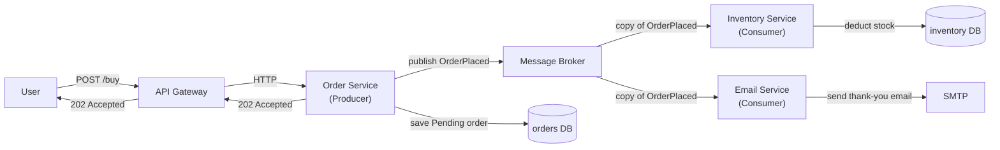

### **Week 2: Asynchronous Communication & Message Queues**

### **Day 8: Intro to Event-Driven Architecture (EDA)**

Today we shift our entire mental model. In Week 1, our services were **bossy** — the Order Service told the Inventory Service, "Check this stock right now and give me the answer." In Week 2, our services become **gossips** — the Order Service simply announces, "Hey everyone, an order was just placed!" and moves on without caring who is listening or what they do with it.

#### **1. The Core Concepts of EDA**

- **Temporal Decoupling:** Services don't need to be alive at the same time. If the Inventory Service goes down for 5 minutes, the Order Service keeps accepting traffic and dropping messages into the queue. When Inventory comes back, it processes the backlog.
- **Spatial Decoupling:** The Order Service no longer needs to know the IP address or DNS name of the Inventory Service. It only needs to know where the Message Broker is.

#### **2. Commands vs. Events**

This is the most common stumbling block when learning async systems.

| | Command | Event |
|---|---|---|
| **Example naming** | `UpdateInventory`, `ChargeCreditCard` | `OrderPlaced`, `PaymentSucceeded` |
| **Intent** | A directive — do this specific thing | An immutable fact — something already happened |
| **Sender expectation** | Expects a response or confirmation | Fire-and-forget; doesn't care who listens |

#### **3. The Pub/Sub Pattern**

Notice: you added the Email Service without changing a single line of the Order Service code. **That is the magic of EDA.**

#### **4. The Trade-off: Eventual Consistency**

We trade the risk of cascading failures for **eventual consistency**. When a user clicks "Buy," the Order Service instantly returns "Success! Your order is processing." The inventory hasn't been deducted yet — it _will_ be, usually within milliseconds — but for a brief moment the system is technically out of sync.

---

### **Actionable Task for Today**

No coding today. Map out the Pub/Sub flow above on paper:

1. **Producer:** User hits the API Gateway → Order Service saves a "Pending" order to its own DB.
2. **Event:** Order Service publishes `OrderPlaced` (containing `item_name` and `user_id`) to a broker.
3. **Consumers:** Draw two separate services — `Inventory Service` (deduct stock) and `Email Service` (send confirmation).

---

### **Day 8 Revision Question**

Imagine only **1** Nakroth skin is left in stock. User A and User B both click "Buy" at the exact same moment. The Order Service accepts both orders asynchronously and tells both users "Success!" When the Inventory Service reads those events a moment later, it realizes it only has 1 skin for 2 buyers.

**How does a real-world async system like Amazon handle this scenario?**

**Answer: Compensating Transactions**

Amazon takes a business-first approach — they don't make you wait on a loading spinner. They accept the order instantly.

If the Inventory Service later realizes the item is gone, it publishes a new event: `OrderFailed`. Other services react:

1. The `Payment Service` issues a full refund.
2. The `Email Service` sends: _"We're so sorry — the item you ordered went out of stock. We've refunded your card."_

It is better to apologize later than to make 100,000 users stare at a loading screen.
