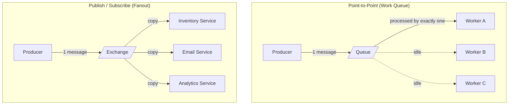

### **Day 9: Message Queues & Brokers**

Today we introduce the middleman: the **Message Broker**. Instead of services talking directly to each other, they leave messages for each other inside this broker.

#### **1. What is a Message Broker?**

Think of it like a highly efficient post office.

- **Producers:** Services that create messages (e.g., the Order Service).
- **Consumers:** Services that read messages (e.g., the Inventory Service).
- **The Broker:** The software in the middle that holds messages in memory or on disk until consumers are ready for them.

#### **2. Point-to-Point vs. Publish/Subscribe**



- **Point-to-Point (Work Queues):** One producer sends a message; exactly _one_ consumer processes it. If you have 5 instances of an Image Processing Service, they round-robin the work. Great for load balancing heavy tasks.
- **Publish/Subscribe (Pub/Sub):** One producer sends a message; _multiple_ different services each receive a copy. This is what we designed yesterday — Inventory and Email both react to the same `OrderPlaced` event.

#### **3. Introducing RabbitMQ**

RabbitMQ is one of the most widely used, battle-tested open-source message brokers. It implements **AMQP** (Advanced Message Queuing Protocol) and excels at complex routing — ensuring the right messages go to exactly the right queues.

---

### **Actionable Task for Today**

Spin up RabbitMQ locally using Docker Compose and explore its management UI.

1. Create `week2-async/docker-compose.yml`:

```yaml
version: "3.8"
services:
  rabbitmq:
    image: rabbitmq:3-management-alpine
    container_name: rabbitmq-broker
    ports:
      - "5672:5672"    # AMQP — your Go/Python code connects here
      - "15672:15672"  # Web management UI
    environment:
      RABBITMQ_DEFAULT_USER: guest
      RABBITMQ_DEFAULT_PASS: guest
```

2. Run: `docker-compose up -d`
3. Open: `http://localhost:15672` — log in with `guest` / `guest`.
4. Click through the **Connections**, **Channels**, **Exchanges**, and **Queues** tabs. They are empty now, but tomorrow's code will fill them up.

---

### **Day 9 Revision Question**

We exposed port `15672` for the RabbitMQ UI. In a production cloud environment, why would this be a massive security risk — and how should teams access it safely?

**Answer:**

**The Risk:**
1. Default credentials like `guest`/`guest` are notoriously left unchanged.
2. If a hacker gains access to the RabbitMQ UI, they can see every queue, exchange, and service name in your backend — a complete treasure map of your architecture.

**The Fix:**
Place the RabbitMQ container inside a **Private Subnet** so it has no public IP address and is invisible to the internet. Teams access it via:
- A **VPN**, so your laptop acts as if it's inside the private network.
- A **Bastion Host / Jump Box** — a hardened server in the public subnet that you SSH into, and from there tunnel into the private subnet.
