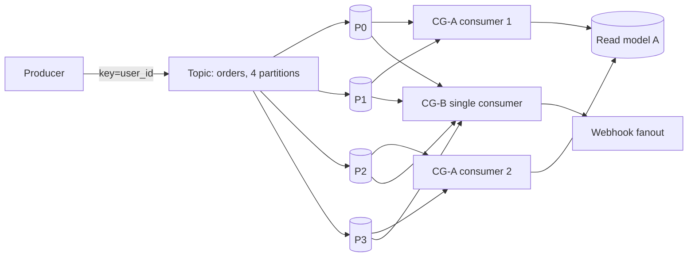
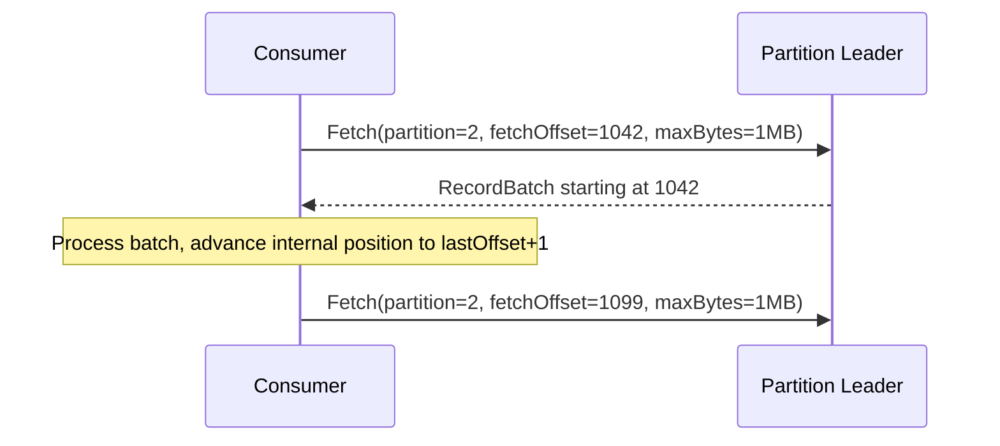
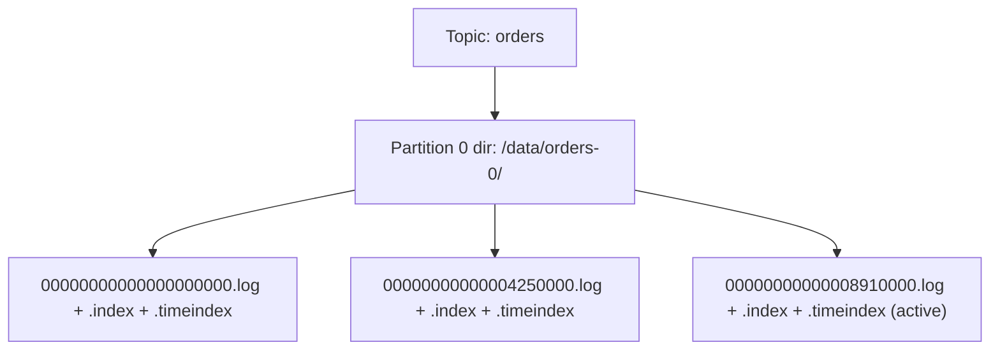
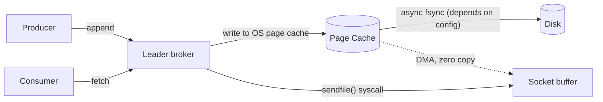
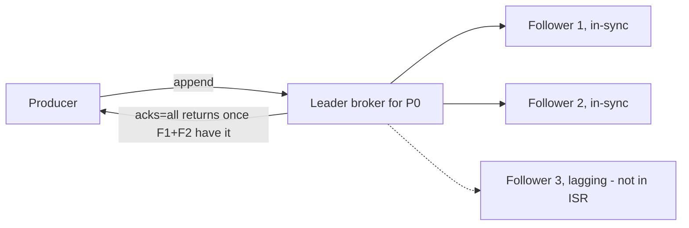
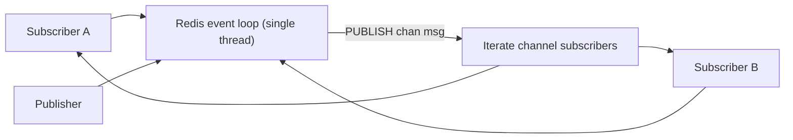
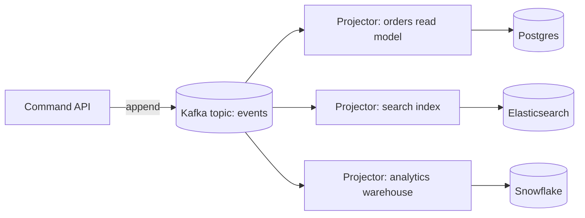
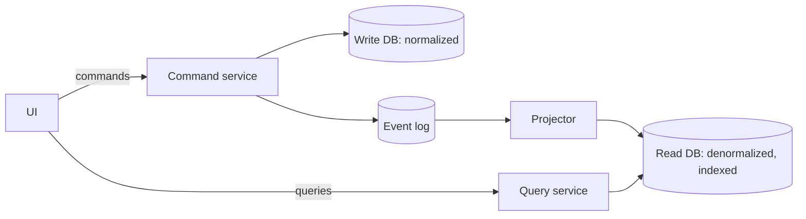

# Week 3 — Event Streaming & Advanced Patterns, Deep Intro

[Back to top README](../../README.md)

## TL;DR

- **What you learn:** how an append-only log (Kafka) replaces transient queues, and how to split reads from writes (CQRS) and store events as truth (event sourcing).
- **Tools:** Apache Kafka, Redis Pub/Sub, a read-side projector.
- **Mental model:** the **log is the database**. Order is per-partition. Consumers track their own position.

---

## Architecture at a glance



Two consumer groups read the **same** events independently. CG-A scales out by splitting partitions across two consumers. CG-B is one consumer reading all partitions. Each group has its own committed offset per partition — that is what lets you replay from any point in time.

---

## Protocol / byte level

### Kafka record batch on disk and on the wire

```text
RecordBatch:
  baseOffset:        int64
  batchLength:       int32
  partitionLeaderEpoch: int32
  magic:             int8 (= 2)
  crc:               uint32   // CRC32-C over everything below
  attributes:        int16    // compression, timestamp type, txn flag, control flag
  lastOffsetDelta:   int32
  baseTimestamp:     int64
  maxTimestamp:      int64
  producerId:        int64
  producerEpoch:     int16
  baseSequence:      int32
  records:           [Record]
```

Each `Record` inside the batch is a varint-heavy structure:

```text
Record:
  length:            varint
  attributes:        int8
  timestampDelta:    varint  (delta from batch baseTimestamp)
  offsetDelta:       varint  (delta from baseOffset)
  keyLength:         varint
  key:               bytes
  valueLength:       varint
  value:             bytes
  headersCount:      varint
  headers:           [Header]
```

- The whole batch is **compressed as one unit** (snappy / lz4 / zstd / gzip). Compression ratio is much better than per-record because keys and headers repeat.
- Producer sequence numbers + producer ID are how Kafka deduplicates retries on the broker side, giving idempotent producers.

### Kafka producer request (Produce v9+)

```text
Produce Request:
  transactionalId:   nullable string
  acks:              int16   // 0 = none, 1 = leader, -1 = all in-sync replicas
  timeoutMs:         int32
  topicData:         [
    { topic, partitionData: [ { partition, recordBatch } ] }
  ]
```

`acks=all` + `min.insync.replicas=2` is the canonical durability setting: a write only succeeds once the leader plus at least one follower have it on disk.

### Fetch protocol



The consumer drives the pace. The broker only returns what is already committed to the local log — there is no "push" to a slow consumer.

---

## System internals

### Topic → partition → segment files



- Each partition is a directory. Inside, log data is sliced into **segments** (default ~1 GB or by time). Only the active segment is being appended to.
- `.log` is the raw record bytes. `.index` is a sparse offset → byte-position map. `.timeindex` is timestamp → offset.
- Old segments are deleted by **retention policy** (time, size) or **compacted** (keep latest record per key — used for changelog topics and CQRS read-model rebuilds).

### Why Kafka is fast — page cache + zero-copy



- Writes go to the OS page cache. The broker process barely touches the bytes.
- For consumers, Kafka calls `sendfile(2)` — the kernel ships bytes directly from page cache to the socket NIC buffer, skipping userspace entirely. This is a major reason a single broker can saturate a 10 GbE NIC.

### ISR, leader, and `acks=all`



- **ISR** = In-Sync Replicas: followers caught up within `replica.lag.time.max.ms`.
- If the leader dies, the controller picks a new leader from the ISR — preserving committed data.
- If you set `unclean.leader.election=true`, a non-ISR follower can take over → faster recovery but possible data loss. Default is `false`.

### Consumer group coordinator + rebalance

```mermaid
sequenceDiagram
    participant C1 as Consumer 1
    participant C2 as Consumer 2
    participant GC as Group Coordinator
    C1->>GC: JoinGroup(memberId=null)
    C2->>GC: JoinGroup(memberId=null)
    GC-->>C1: leader, member list
    GC-->>C2: follower
    C1->>GC: SyncGroup(assignment plan: P0,P1 -> C1; P2,P3 -> C2)
    GC-->>C1: your partitions = P0,P1
    GC-->>C2: your partitions = P2,P3
    loop heartbeat every session.timeout.ms / 3
      C1->>GC: Heartbeat
      C2->>GC: Heartbeat
    end
    Note over C2: C2 crashes, stops heartbeating
    GC-->>C1: rebalance: you now own P0..P3
```

- Offsets per `(group, topic, partition)` are stored in the internal **`__consumer_offsets`** topic — itself a compacted Kafka topic. The latest commit per key wins.
- Modern clients use **incremental cooperative rebalancing** (KIP-429): only the affected partitions move, instead of "stop the world".

### Redis Pub/Sub — single-threaded event loop



- One thread runs an `epoll` / `kqueue` loop. `PUBLISH` is O(N+M) where N is subscribers on the channel and M is pattern subscribers checked.
- **No persistence, no replay**: a slow or disconnected subscriber simply misses messages. This is fundamentally different from Kafka. Redis Pub/Sub is for **ephemeral** signals (cache invalidation, WebSocket fanout to currently-online users), not durable events.
- For persistent streaming on Redis, use **Redis Streams** (`XADD` / `XREADGROUP`) instead.

---

## Mental models

### The log is the source of truth



- All side databases are **derived** from the log. To rebuild any of them: drop it, reset the consumer offset to 0, replay.
- This is the difference between a queue and a stream. A queue forgets after ack; a log keeps history (until retention) and lets you spin up new readers months later.

### Per-key ordering, never global

- Kafka guarantees order **within a partition**, never across partitions.
- The producer chooses the partition by hashing the **key**. Same key → same partition → strict order for that key.
- If you need ordering for `user_id=42`, set `key = "42"` for every event about that user.

### CQRS — separate write and read shapes



- Writes are validated against the normalized write model.
- Reads hit a denormalized read model optimized for the query patterns of the UI.
- The read model is **eventually consistent** with the write model. The latency between them is the lag of the projector — measure it, alert on it.

### Event sourcing in one paragraph

Instead of storing the current state of an order (`status='SHIPPED'`), store the **events** (`OrderPlaced`, `PaymentCaptured`, `Shipped`). Current state is the fold of all events for that aggregate. Snapshots are an optimization. You get a perfect audit log and the ability to add new projections retroactively.

---

## Failure modes

- **Hot partition** — bad key choice (e.g. `key="us-east"` for half your traffic). Mitigation: choose higher-cardinality keys, add `_random_suffix` salt if order is not needed.
- **Consumer lag growing** — projector is slower than producer. Mitigation: scale consumers up to partition count, batch DB writes, profile the slow handler.
- **Rebalance storms** — long GC pauses or slow `poll()` loops cause heartbeat misses → constant rebalance. Mitigation: increase `session.timeout.ms`, decrease `max.poll.records`, move work off the poll thread.
- **Offset committed before processing** (`enable.auto.commit=true`) — message lost on crash. Mitigation: manual commit after the side effect succeeds.
- **Log retention shorter than consumer downtime** — consumer comes back, position is gone. Mitigation: set retention to your tolerated outage window, alert on `log.start.offset` advancing past committed offsets.
- **Redis Pub/Sub used as a queue** — silent message loss when subscribers disconnect. Mitigation: use Redis Streams or a real broker.

---

## Day-by-day links

- [Day 15 — Queues vs Event Streams](day15-queues_vs_event_streams.md)
- [Day 16 — Kafka Fundamentals](day16-Apache_Kafka_fundamentals.md)
- [Day 17 — Kafka in practice (Go)](day17-Kafka_in_practice.md)
- [Day 18 — Redis Pub/Sub](day18-Redis_PubSub.md)
- [Day 19 — CQRS](day19-CQRS.md)
- [Day 20 — Event Sourcing](day20-event_sourcing.md)
- [Day 21 — Project: Command + Query split](day21-consolidation_challenge.md)
