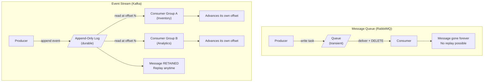

### **Week 3: Event Streaming & Advanced Patterns**

### **Day 15: Queues vs. Event Streams (The Paradigm Shift)**

Today we shift from **Message Queues** (RabbitMQ/SQS) to **Event Streams** (Apache Kafka). To understand Kafka, you must unlearn how RabbitMQ works.

#### **1. The Queue Mindset (Transient)**

- **Analogy:** A To-Do List.
- **How it works:** You write down a task. A worker reads it, does the job, and crosses it off (deletes it).
- **The Problem:** Once it's crossed off, it is gone forever. If a new worker joins tomorrow and asks "What tasks did we do yesterday?", the queue has no idea.

#### **2. The Stream Mindset (Durable & Append-Only)**

- **Analogy:** A Captain's Log or a Diary.
- **How it works:** Events are written sequentially into an **Append-Only Log** on a hard drive. You can add to the bottom but you can never delete or modify what is already written.
- **The Magic:** Because the broker doesn't delete messages, consumers are responsible for keeping track of their own position using a **Offset** (a bookmark).



#### **3. Smart Broker vs. Dumb Broker**

- **RabbitMQ: Smart Broker / Dumb Consumer.** RabbitMQ does all the heavy lifting — routes messages, tracks who has what, waits for ACKs, and deletes the data.
- **Kafka: Dumb Broker / Smart Consumer.** Kafka just dumps bytes onto a hard drive as fast as possible. Consumers are smart enough to track their own offsets. Because Kafka does so little, it can process _millions_ of messages per second.

---

### **Actionable Task for Today**

Set up the Kafka Docker container you will use for the rest of Week 3.

Create `week3-streaming/docker-compose.yml` using a modern KRaft-based image (no Zookeeper needed):

```yaml
version: "3.8"
services:
  kafka:
    image: bitnami/kafka:latest
    ports:
      - "9092:9092"
    environment:
      - KAFKA_ENABLE_KRAFT=yes
      - KAFKA_CFG_PROCESS_ROLES=broker,controller
      - KAFKA_CFG_CONTROLLER_LISTENER_NAMES=CONTROLLER
      - KAFKA_CFG_LISTENERS=PLAINTEXT://:9092,CONTROLLER://:9093
      - KAFKA_CFG_LISTENER_SECURITY_PROTOCOL_MAP=CONTROLLER:PLAINTEXT,PLAINTEXT:PLAINTEXT
      - KAFKA_CFG_ADVERTISED_LISTENERS=PLAINTEXT://localhost:9092
      - KAFKA_BROKER_ID=1
      - KAFKA_CFG_CONTROLLER_QUORUM_VOTERS=1@kafka:9093
      - ALLOW_PLAINTEXT_LISTENER=yes
```

Run `docker-compose up -d`. Tomorrow we will connect to it.

---

### **Day 15 Revision Question**

Kafka stores every event permanently on hard drives. If Amazon processes 50 million orders a day and Kafka never deletes messages, what eventually happens — and how does Kafka solve this?

**Answer: Retention Policies (The Sliding Window)**

Kafka implements configurable retention to prevent disks from filling up:

1. **Time-Based Retention (Default: 7 days):** As soon as a message is 7 days old, Kafka quietly drops it from the back of the log.
2. **Size-Based Retention:** Limit a topic to a maximum size, e.g., 500 GB. When the limit is hit, the oldest messages are dropped.
3. **Log Compaction:** For topics representing database state (e.g., user profiles), Kafka keeps only the **most recent event per key**. If there are 50 updates for `user_123`, Kafka deletes the 49 old ones and retains only the latest — giving you the current state without unbounded growth.
