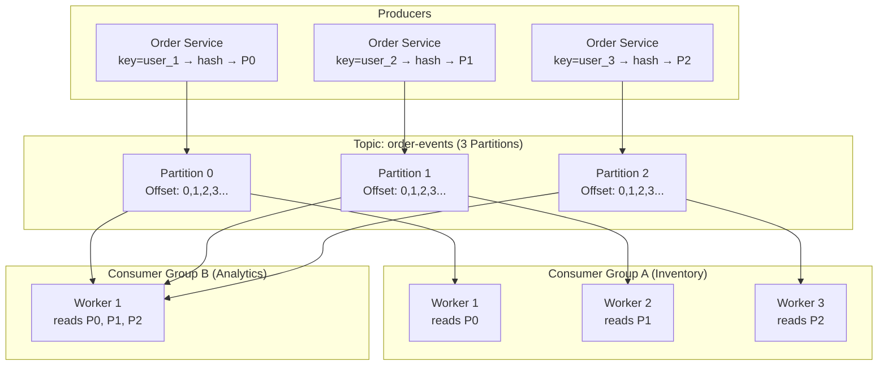

### **Day 16: Apache Kafka Fundamentals**

Today we map your Queue vocabulary to your new Stream vocabulary.

#### **1. The Core Vocabulary**

- **Topic (instead of Queue):** A named stream of records. Think of it like a database table. You publish to a Topic (e.g., `order-events`), not a queue.
- **Partition (the secret to scale):** A single topic is split into multiple Partitions spread across different physical hard drives. 10,000 producers can write to the same topic simultaneously, writing to different partitions in parallel — no single file lock bottleneck.
- **Offset:** A sequential ID assigned to each message as it arrives in a partition (Message 0, Message 1, Message 2...). This is the consumer's "bookmark."
- **Consumer Group:** The scaling unit for reading. If you put 3 instances of your Inventory Service into the same Consumer Group, Kafka automatically divides the topic's partitions among them — they don't process duplicates, they share the work.

#### **2. How Kafka Routes Data**

Kafka doesn't have Exchanges. Instead, when a producer sends a message it can include a **Key** (like `user_id`). Kafka hashes the key and uses it to choose the Partition.

**Rule of thumb:** Messages with the _same key_ always go to the _same partition_ — guaranteeing they are processed in the exact order they occurred.



---

### **Actionable Task for Today**

Interact with Kafka using its built-in CLI tools.

1. **Create a topic with 3 partitions:**

```bash
docker exec -it <kafka-container-name> /opt/kafka/bin/kafka-topics.sh \
  --create --topic order-events \
  --partitions 3 \
  --replication-factor 1 \
  --bootstrap-server localhost:9092
```

2. **Start an interactive Producer (Terminal 2):**

```bash
docker exec -it <kafka-container-name> /opt/kafka/bin/kafka-console-producer.sh \
  --topic order-events \
  --bootstrap-server localhost:9092
```

Type `Hello Kafka` and `Order 2 placed` and press Enter after each.

3. **Start a Consumer (Terminal 3):**

```bash
docker exec -it <kafka-container-name> /opt/kafka/bin/kafka-console-consumer.sh \
  --topic order-events \
  --from-beginning \
  --bootstrap-server localhost:9092
```

**Experiment:** Stop the consumer (CTRL+C). Type 5 more messages in the Producer. Restart the consumer _without_ `--from-beginning` — it misses the 5 messages. Restart _with_ `--from-beginning` — it reads all of them from the start. **The messages were never deleted.**

---

### **Day 16 Revision Question**

Kafka's Consumer Groups are the key to scalability, but they have one strict mathematical rule. You have a topic `website-clicks` with **3 Partitions** and you spin up **5 Worker instances** in the same Consumer Group.

**What exactly happens to those 5 workers, and why is this an important architectural constraint?**

**Answer: The Golden Rule of Kafka**

**One Partition can be consumed by AT MOST ONE Consumer within a specific Consumer Group.**

With 3 partitions and 5 workers:

- Worker 1 → Partition 0
- Worker 2 → Partition 1
- Worker 3 → Partition 2
- **Worker 4 and Worker 5 → sit 100% idle**

**Why does Kafka enforce this?**
If Worker 4 and Worker 1 both read from Partition 0 simultaneously, they would race each other. Worker 4 might process the `DeleteUser` event before Worker 1 finishes `CreateUser` — destroying database integrity.

**The architectural lesson:** Your maximum horizontal scale-out for a consumer group is capped by your partition count. If you think you'll need 10 workers in the future, create the topic with at least 10 partitions on Day 1 — you cannot easily add partitions later.
