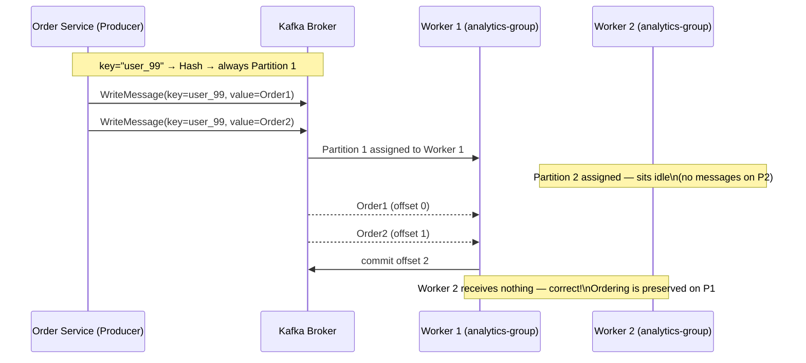

### **Day 17: Kafka in Practice (Writing the Code)**

Today we write a Go Producer and Consumer using the `kafka-go` library by Segment.

#### **1. Project Setup**

```bash
go mod init week3-streaming
go get github.com/segmentio/kafka-go
```

Create folders: `producer/` and `consumer/`.

#### **2. The Producer Code**

In `producer/main.go`:

```go
package main

import (
	"context"
	"fmt"
	"log"
	"time"

	"github.com/segmentio/kafka-go"
)

func main() {
	w := &kafka.Writer{
		Addr:     kafka.TCP("localhost:9092"),
		Topic:    "order-events",
		Balancer: &kafka.Hash{}, // Routes messages with same key to same partition
	}
	defer w.Close()

	for i := 1; i <= 10; i++ {
		// All messages for user_99 ALWAYS go to the same partition — ordering guaranteed
		key := []byte("user_99")
		value := []byte(fmt.Sprintf("Order %d placed by User 99", i))

		err := w.WriteMessages(context.Background(),
			kafka.Message{
				Key:   key,
				Value: value,
			},
		)
		if err != nil {
			log.Fatalf("failed to write messages: %v", err)
		}

		log.Printf("Sent: %s", string(value))
		time.Sleep(1 * time.Second)
	}
}
```

#### **3. The Consumer Code**

In `consumer/main.go`:

```go
package main

import (
	"context"
	"fmt"
	"log"

	"github.com/segmentio/kafka-go"
)

func main() {
	r := kafka.NewReader(kafka.ReaderConfig{
		Brokers:  []string{"localhost:9092"},
		GroupID:  "analytics-group", // critical — defines which consumer group
		Topic:    "order-events",
		MinBytes: 10e3, // 10KB
		MaxBytes: 10e6, // 10MB
	})
	defer r.Close()

	log.Println("Analytics Worker started. Waiting for messages...")

	for {
		m, err := r.ReadMessage(context.Background())
		if err != nil {
			log.Fatalf("failed to read message: %v", err)
		}
		fmt.Printf("Worker received on Partition %d: %s = %s\n", m.Partition, string(m.Key), string(m.Value))
	}
}
```



---

### **Actionable Task for Today**

Prove the Golden Rule of Kafka:

1. Open three terminals.
2. Terminal 1 and 2: `go run consumer/main.go` (both use `GroupID: "analytics-group"`).
3. Terminal 3: `go run producer/main.go`.
4. Because the key is hardcoded to `"user_99"`, the Hash balancer picks exactly one partition — only **one** consumer does 100% of the work. The other sits idle.
5. **Experiment:** Change the key to be random (`"user_1"`, `"user_2"`, etc.) and rerun. Watch Kafka evenly distribute work across both consumers.

---

### **Day 17 Revision Question**

Even with the same key, is the Order Service guaranteed to send messages to Kafka in the exact order the user clicked the button? Why or why not?

**Answer:**

Even though Kafka strictly orders messages _inside a single partition_, **Kafka can only order messages based on when it receives them, not when the user clicked.**

If 10,000 users click at the same time, Go's CPU scheduler executes those 10,000 Goroutines in an unpredictable order. User #5's Goroutine might call `WriteMessages` before User #1's.

**The Golden Rule:** Kafka guarantees the order of _receipt_, not the order of _creation_. If you absolutely need creation-time ordering, you must attach client-side timestamps and sort them later in your analytics database.
