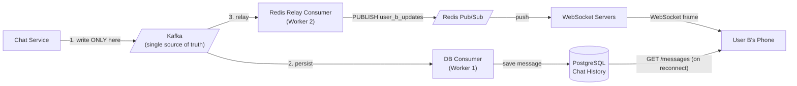

### **Day 18: Redis Pub/Sub & In-Memory Messaging**

Today we look at **Redis**. You likely know it as a blazing-fast in-memory cache, but it also has a built-in messaging system called **Redis Pub/Sub**.

If Kafka is a heavy, durable hard drive that remembers everything, Redis Pub/Sub is a fleeting whisper in the wind.

#### **1. How Redis Pub/Sub Works**

- **The Concept:** A Publisher sends a message to a "Channel." Subscribers listen to that Channel.
- **The Catch (100% Ephemeral):** Redis does **not** store Pub/Sub messages — not on disk, not even in memory. It receives the message and immediately pushes it down the TCP socket to whoever is currently connected.
- **The Consequence:** If your Consumer crashes and a message is published while it's rebooting, that message is **gone forever**. There is no queue, no offset to rewind.

#### **2. Why use it if it loses data?**

Because it is **unbelievably fast** with incredibly low latency. Use it when history doesn't matter and you only care about _right now_:

- **Good use cases:** Live multiplayer game coordinates, live streaming chat (Twitch/YouTube), real-time stock price tickers.
- **Bad use cases:** Order processing, payments, inventory management — anything where you cannot afford to lose a message.

#### **3. The Microservice WebSocket Pattern**

The most common use of Redis Pub/Sub in microservices: you have 5 instances of a WebSocket Service keeping connections open to 100,000 user browsers. The Order Service finishes an order and publishes to Redis channel `user_123_updates`. All 5 WebSocket servers hear it instantly, but only the one holding the connection for `user_123` forwards the message to the browser — a real-time UI update without a page refresh.

---

### **Actionable Task for Today**

Observe the "whisper in the wind" in action.

```bash
# Spin up Redis
docker run --name my-redis -p 6379:6379 -d redis
```

**Terminal 1 (Subscriber):**
```bash
docker exec -it my-redis redis-cli
> SUBSCRIBE live_chat
```

**Terminal 2 (Publisher):**
```bash
docker exec -it my-redis redis-cli
> PUBLISH live_chat "Hello from the Publisher!"
```

Watch Terminal 1 receive the message instantly.

**The Ephemeral Test:** Kill the subscriber (CTRL+C). Publish 3 more messages. Re-subscribe. Those 3 messages are completely gone — Redis didn't save them.

---

### **Day 18 Revision Question**

You are building a chat app like WhatsApp. You need the blazing real-time speed of Redis Pub/Sub when both users are online, but if a user's phone is turned off, the message must be delivered when they turn it back on tomorrow — which Redis cannot do.

**How do you architect a system combining Kafka, a database, and Redis to get both real-time speed AND durable delivery?**

**Answer: The Relay Pattern**

Your first instinct — "write to both Redis and Kafka simultaneously" — runs into the **Dual-Write Problem**:

```go
err1 := publishToRedis(msg)  // succeeds
err2 := publishToKafka(msg)  // network blips — fails!
```

User A sees the message on screen (via Redis), but the message was never saved to Kafka. On refresh, it's gone.

**The correct solution:** Make Kafka the single source of truth, then use a Relay Consumer to get Redis speed.



**When User B's phone is off:** They miss the Redis broadcast entirely — but that's fine! When they reconnect, their app fetches chat history from PostgreSQL via a standard REST `GET /messages`.

You have successfully separated the _Write_ (durable, Kafka) from the _Read_ (fast, Redis) logic. This is exactly what leads us into CQRS.

> **Note on Redis Persistence:** Redis can persist `SET` commands to disk via RDB or AOF, but **Pub/Sub completely bypasses this**. A `PUBLISH` command is fire-and-forget even with persistence enabled. Redis 5.0 introduced **Redis Streams** specifically to act like Kafka with consumer groups and offsets — but classic Pub/Sub remains ephemeral.
