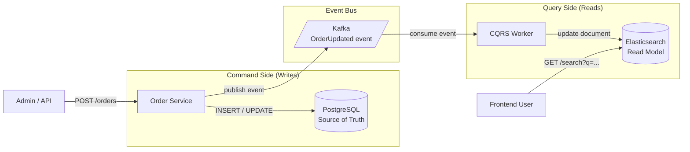

### **Day 19: CQRS (Command Query Responsibility Segregation)**

By combining Kafka, databases, and Redis in Day 18, we accidentally designed a CQRS system. Today we name it properly.

#### **1. What is CQRS?**

In traditional apps, you use the same database and often the same code models to both _write_ and _read_ data.

CQRS says: **"Writing data is fundamentally different from reading data. Split them into two entirely separate systems."**

- **The Command Side (Writes):** Focuses on business rules, validation, and safely storing truth. Usually a relational database (Postgres/MySQL) or an event stream (Kafka).
- **The Query Side (Reads):** Focuses entirely on speed and UI presentation. Usually a NoSQL database (MongoDB), a search engine (Elasticsearch), or an in-memory cache (Redis).

#### **2. How Do They Stay in Sync? Events.**

**The flow:**
1. A user places an order (Command) → saved to Postgres.
2. The Order Service publishes `OrderUpdated` to Kafka.
3. A worker reads Kafka and updates an Elasticsearch document (Query).
4. The user visits their dashboard → the UI queries Elasticsearch (lightning fast, great for text search), bypassing the heavy Postgres DB entirely.

---

### **Actionable Task for Today**

Map out a CQRS architecture for an **E-commerce Product Search Page**:

1. **Command Side:** An Admin updates the price of "Nakroth Skin" in the core SQL database.
2. **Event:** How does that price change get into the broker? (Hint: the Order Service publishes a `PriceUpdated` event after saving to Postgres.)
3. **Query Side:** The frontend queries Elasticsearch for items. A worker consumes the Kafka event and updates the Elasticsearch index.

---

### **Day 19 Revision Question**

CQRS gives us amazing read speed, but it introduces **eventual consistency**. An Admin changes a price from $10 to $15, clicks "Save," and immediately refreshes the product page — it still shows "$10" for a few seconds while the event travels through Kafka and updates Elasticsearch.

**How do you handle this UI/UX problem where the user sees stale data right after a write?**

**Answer:**

The best solution to an eventual consistency problem is often a **UI trick** — manage the user's expectations rather than bending the laws of network physics.

Two primary frontend strategies:

1. **Honest UI (Loading State):** The Admin clicks "Save." The UI immediately shows a spinning sync icon or _"Price update queued..."_ toast. It stays there until the frontend receives a WebSocket confirmation that Elasticsearch has been updated.

2. **Optimistic UI (Assume success):** The UI _assumes_ the backend will succeed and instantly changes the price to `$15` on screen — blazing fast. Behind the scenes it waits for backend confirmation. If Kafka crashes and the backend returns a failure 5 seconds later, the UI reverts to `$10` and shows: _"Failed to save — please try again."_

Optimistic UI is great for non-critical actions (liking a tweet). Honest UI (pending state) is better for administrative actions where accuracy matters.
