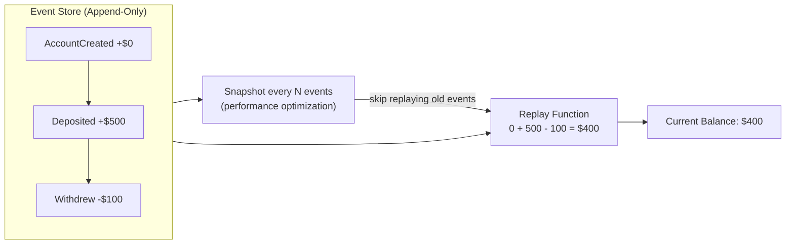
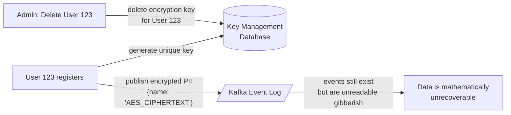

### **Day 20: Event Sourcing**

We touched on Event Sourcing briefly at the end of Week 2. Today we define it precisely — it is the ultimate evolution of Event-Driven Architecture.

#### **1. The Flaw of Traditional Databases**

In traditional CRUD systems, your database stores only **current state**. If a user's bank balance is `$500` and they withdraw `$100`, you run `UPDATE balance = 400` — permanently overwriting the old value.

**The problem:** You destroyed the history. The database can't tell you _why_ the balance is `$400`. You typically have to build messy, separate "audit log" tables to track this.

#### **2. The Event Sourcing Paradigm**

Event Sourcing says: **stop storing current state. Only store the events that happened.**

Think of a bank ledger:

| Event | Amount |
|---|---|
| `AccountCreated` | +$0 |
| `Deposited` | +$500 |
| `Withdrew` | -$100 |

To get the current balance, you don't query a `balance` column. You replay all events: `0 + 500 - 100 = $400`.

#### **3. Why is this Powerful?**

- **100% Auditability:** A mathematically perfect, tamper-proof history. You can never lose data to a bad `UPDATE`.
- **Time Travel:** Rebuild the exact state at any point in time. "What was this user's cart last Tuesday at 4:00 PM?" Just replay events up to that exact timestamp and stop.
- **Perfect for Kafka + CQRS:** Kafka is the ultimate append-only event log. Use it as your source of truth (Event Sourcing) and replay events to build fast read-models in Elasticsearch or Redis (CQRS).

#### **4. The Catch: Snapshots**

Replaying 10,000 events every time a user logs in is slow. The fix: **Snapshots**. Every 100 events, save a snapshot of the current state (`balance = 400`). Next time, load the snapshot and only replay events _after_ it.

---

### **Actionable Task for Today**

Map out a **Shopping Cart Service** built with Event Sourcing.

Write down 4 events: user added Nakroth Skin, added Health Potion, removed Health Potion, then checked out.
What does the "Current State" look like after replaying all 4 events?

---

### **Day 20 Revision Question**

Event Sourcing relies on an append-only log — you can never run `UPDATE` or `DELETE` on past events. But modern privacy laws like **GDPR** give users the legal right to demand permanent deletion of all their personal data.

**If your architecture uses an immutable event log spanning 5 years, how do you legally comply with a "Right to be Forgotten" request?**

**Answer:**

Two industry-standard approaches:

#### **1. Crypto-Shredding (The Most Elegant Solution)**

- When User 123 registers, generate a unique cryptographic key and store it in a secure Key Management Service (KMS).
- Whenever you publish an event containing PII (name, email, address), encrypt that PII using their unique key. The event in Kafka looks like meaningless ciphertext.
- **To delete the user:** Don't touch Kafka. Simply delete their encryption key from the KMS. Instantly, all historical events scatter across 5 years of logs become permanently, mathematically unreadable.

#### **2. Kafka Tombstones + Log Compaction**

Publish a new event to Kafka with the user's ID as the Key and set the payload to `null`. This is called a **Tombstone** message.

When Kafka runs its background log compaction, it sees the Tombstone and actively deletes all previous events with that key — permanently purging the data from the log.
