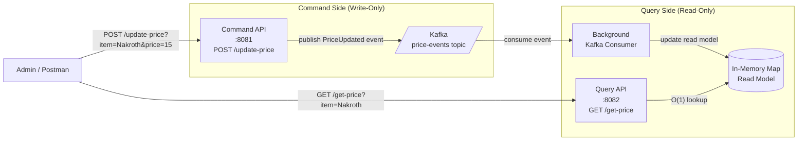

### **Day 21: Week 3 Consolidation Project**

Today we build a mini CQRS + Event Sourced architecture — separating writes from reads in a live, running system.

#### **The Architecture**



**Key insight:** The Command Service never saves to a database directly — Kafka _is_ the database (Event Sourcing). The Query Service builds its own read model from the Kafka stream (CQRS).

#### **1. Project Setup**

```text
week3-final/
├── docker-compose.yml   # Reuse Kafka config from Day 15
├── cmd/                 # Command Service (write-only)
│   └── main.go
└── query/               # Query Service (read-only)
    └── main.go
```

#### **2. The Command Service (Write-Only)**

In `cmd/main.go`:

```go
package main

import (
	"context"
	"fmt"
	"log"
	"net/http"

	"github.com/segmentio/kafka-go"
)

var writer *kafka.Writer

func updatePriceHandler(w http.ResponseWriter, r *http.Request) {
	item := r.URL.Query().Get("item")
	price := r.URL.Query().Get("price")

	// Store the FACT that the price changed — not the price itself
	eventPayload := fmt.Sprintf(`{"item": "%s", "new_price": "%s"}`, item, price)

	err := writer.WriteMessages(context.Background(),
		kafka.Message{
			Key:   []byte(item), // Keep events for the same item ordered
			Value: []byte(eventPayload),
		},
	)
	if err != nil {
		http.Error(w, "Failed to publish event", http.StatusInternalServerError)
		return
	}

	w.Write([]byte(fmt.Sprintf("Command Accepted: %s price update queued.\n", item)))
}

func main() {
	writer = &kafka.Writer{
		Addr:     kafka.TCP("localhost:9092"),
		Topic:    "price-events",
		Balancer: &kafka.Hash{},
	}
	defer writer.Close()

	http.HandleFunc("/update-price", updatePriceHandler)
	log.Println("Command API running on port 8081")
	log.Fatal(http.ListenAndServe(":8081", nil))
}
```

#### **3. The Query Service (Read-Only)**

In `query/main.go`:

```go
package main

import (
	"context"
	"encoding/json"
	"fmt"
	"log"
	"net/http"

	"github.com/segmentio/kafka-go"
)

// Acts as our lightning-fast Read Database (like Redis or Elasticsearch)
var readDatabase = make(map[string]string)

type PriceEvent struct {
	Item     string `json:"item"`
	NewPrice string `json:"new_price"`
}

func getPriceHandler(w http.ResponseWriter, r *http.Request) {
	item := r.URL.Query().Get("item")
	price, exists := readDatabase[item]

	if !exists {
		http.Error(w, "Item not found", http.StatusNotFound)
		return
	}
	w.Write([]byte(fmt.Sprintf("Current price of %s is $%s\n", item, price)))
}

func buildReadModel() {
	reader := kafka.NewReader(kafka.ReaderConfig{
		Brokers: []string{"localhost:9092"},
		GroupID: "query-service-group",
		Topic:   "price-events",
	})
	defer reader.Close()

	log.Println("Listening to Kafka to build Read Model...")
	for {
		m, err := reader.ReadMessage(context.Background())
		if err == nil {
			var event PriceEvent
			json.Unmarshal(m.Value, &event)

			readDatabase[event.Item] = event.NewPrice
			log.Printf("Read Model Updated: %s is now $%s", event.Item, event.NewPrice)
		}
	}
}

func main() {
	// Kafka consumer runs in the background
	go buildReadModel()

	http.HandleFunc("/get-price", getPriceHandler)
	log.Println("Query API running on port 8082")
	log.Fatal(http.ListenAndServe(":8082", nil))
}
```

---

### **Actionable Task for Today**

1. Make sure your Kafka container is running.
2. Terminal 1: `go run query/main.go`
3. Terminal 2: `go run cmd/main.go`
4. Test the full CQRS flow:

```bash
# First, try to read (not yet in read model)
curl http://localhost:8082/get-price?item=Nakroth
# → "Item not found"

# Write via Command API
curl -X POST "http://localhost:8081/update-price?item=Nakroth&price=15"
# → "Command Accepted: Nakroth price update queued."

# Watch Terminal 1 — Kafka consumer picks it up immediately

# Read again
curl http://localhost:8082/get-price?item=Nakroth
# → "Current price of Nakroth is $15"
```

---

### **End of Week 3 Review & Question**

You have survived the most conceptually difficult week — distributed streams, Event Sourcing, and CQRS. You now think the way engineers at Uber, Netflix, and Amazon think.

**To kick off Week 4, consider this scenario:**

You are booking a trip. You have a `Flight Service`, a `Hotel Service`, and a `Rental Car Service`. You want all three — but it's all-or-nothing. If you can't get the rental car, you must cancel both the flight and the hotel.

In a monolith, you'd wrap all three inserts in a SQL `BEGIN TRANSACTION / ROLLBACK`. **But these are three separate microservices with their own separate databases. How do you handle a "rollback" when the 3rd service fails?**
