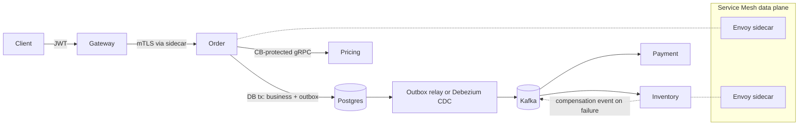
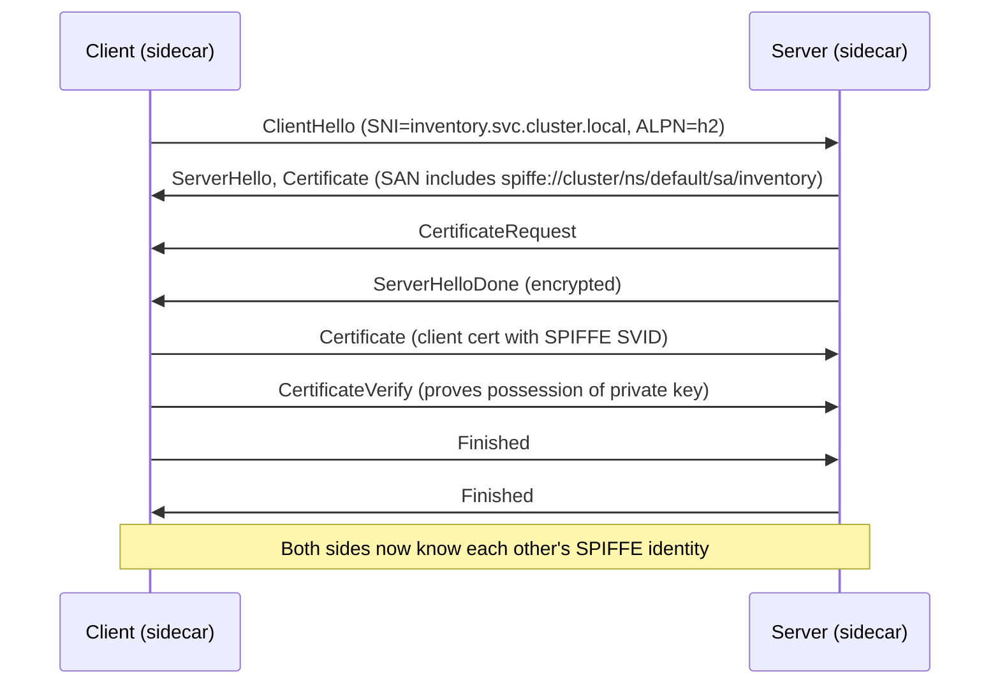
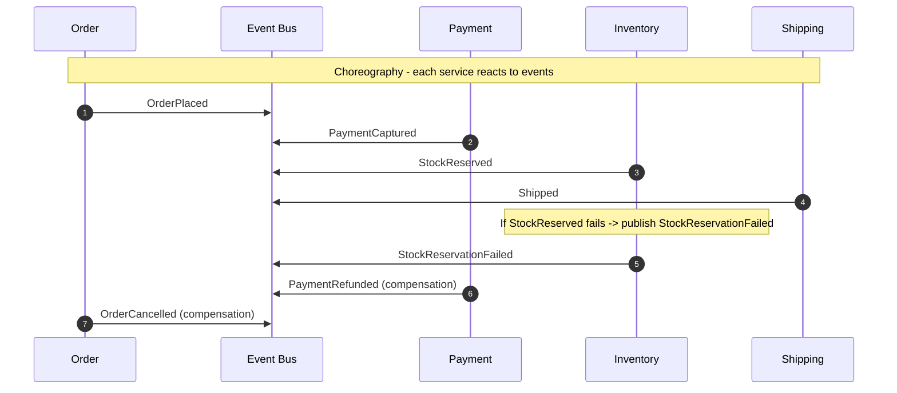
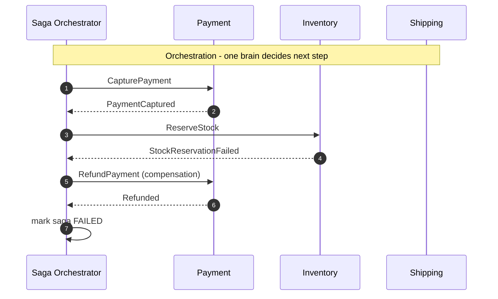
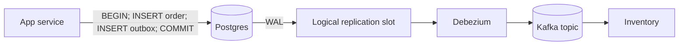
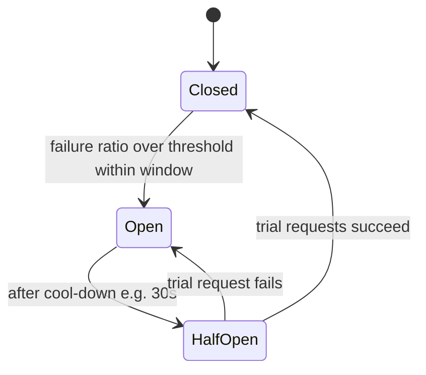
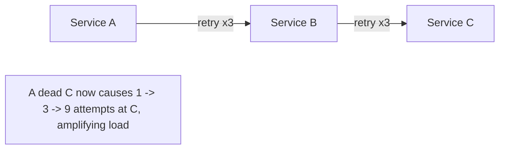
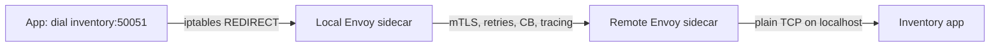

# Week 4 — Resilience, Distributed Transactions & Security, Deep Intro

[Back to top README](../../README.md)

## TL;DR

- **What you learn:** how to keep a distributed system correct and available when the network, dependencies, and services fail.
- **Tools / patterns:** Saga, Transactional Outbox + CDC, Circuit Breakers, Distributed Tracing (W3C `traceparent`), Service Mesh (Envoy), mTLS, JWTs.
- **Mental model:** **failure is the steady state**. Design every call with a budget, a fallback, an audit trail, and a trust boundary.

---

## Architecture at a glance



Every line in the diagram has a failure mode. Week 4 is the toolbox to make that explicit and recoverable.

---

## Protocol / byte level

### W3C `traceparent` header

A single ASCII header propagated on every hop:

```text
traceparent: 00-4bf92f3577b34da6a3ce929d0e0e4736-00f067aa0ba902b7-01
             ^^ ^------------------------------- ^---------------- ^^
             ver trace-id (16 bytes hex, 32 chars) parent-id (8B)  flags (1B)
```

- **trace-id** (128-bit) is the identity of the whole request tree.
- **parent-id** (64-bit) is this hop's span ID; the next hop sets it as `parent-id` for its children.
- **flags** bit 0 = `sampled`. If unset, downstream collectors usually drop the spans.
- The companion `tracestate` header carries vendor-specific extensions without breaking the standard.

### B3 headers (Zipkin) — equivalent meaning, four headers

```text
X-B3-TraceId:      4bf92f3577b34da6a3ce929d0e0e4736
X-B3-SpanId:       00f067aa0ba902b7
X-B3-ParentSpanId: 05e3ac9a4f6e3b90
X-B3-Sampled:      1
```

### JWT structure

```text
eyJhbGciOiJSUzI1NiIsInR5cCI6IkpXVCJ9   // base64url(header)
.eyJzdWIiOiJ1c2VyXzQyIiwiZXhwIjoxNzAwMDAwMDAwfQ // base64url(payload claims)
.SflKxwRJSMeKKF2QT4fwpMeJf36POk6yJV_adQssw5c // base64url(signature)
```

- Three dot-separated base64url segments: **header**, **payload**, **signature**.
- Header declares `alg` (RS256, ES256, etc.) — never trust `alg=none`.
- Payload claims: `iss` (issuer), `sub` (subject), `aud` (audience), `exp`, `iat`, `nbf`, plus your custom ones.
- Signature is computed over `base64url(header) + "." + base64url(payload)` with the issuer's private key. Verifier uses the corresponding public key from JWKS.

### mTLS handshake additions



In a SPIFFE/Istio world, the SAN URI in the cert is the workload identity. Authorization policies match on this URI, not on IP.

---

## System internals

### Saga: choreography vs orchestration





- **Choreography** = no central coordinator, hard to see end-to-end, easy to add a new participant.
- **Orchestration** = one state machine drives the saga, easy to see and to time-out, but the orchestrator becomes a critical service.
- Compensations are **semantic undos**, not transactional rollbacks. `RefundPayment` is not the inverse of `CapturePayment` at the DB level; it is a new operation that nets out the effect.

### Transactional Outbox + CDC



- Single DB transaction writes the business row **and** the outbox row. Atomicity is provided by the database, not by a distributed transaction.
- A **relay** (a polling worker) or a **CDC tool** (Debezium tailing the Postgres WAL via a logical replication slot) reads the outbox and publishes to the broker.
- The relay must be **idempotent**: it might publish the same row twice on retry. Consumers dedupe on the outbox row's `event_id`.

### Circuit breaker state machine



Counters typically tracked in a rolling window:

- `total`, `failures`, `successes`, `slowCalls`, `rejected`
- Failure ratio = `failures / total` over the last N seconds or M requests.
- In `Open`, calls return immediately with a typed error (e.g. `ErrCircuitOpen`), no socket touched. This is how you stop a slow dependency from eating your goroutines.

### Retry budget vs retry storm



- Retry only the **leaf** call, not at every layer.
- Use a **budget** (e.g. retries cap at 10% of total RPS to a dependency) so retries cannot turn an outage into a thundering herd.
- Always combine retries with **exponential backoff + jitter**: `sleep = min(cap, base * 2^attempt) * rand(0.5, 1.5)`.

### Service mesh sidecar data path



- The app makes a normal plain-TCP call. `iptables` (or eBPF) redirects it to the local sidecar.
- The sidecar adds mTLS, propagates `traceparent`, enforces retry/timeout/CB policies, exports metrics.
- Net effect: cross-cutting reliability and security concerns leave application code.

---

## Mental models

### Compensations vs rollbacks

| ACID rollback                  | Saga compensation                           |
|--------------------------------|---------------------------------------------|
| Atomic, automatic              | Application-level, explicit                 |
| Restores byte-for-byte state   | Restores **business** invariants           |
| Hidden from downstream         | Visible: emits a `*Cancelled` / `*Refunded` event |
| Single resource manager        | Each service is its own resource manager    |

### The dual-write problem (revisited and solved)

Week 2 surfaced it; Week 4 fixes it with the outbox. The point is: **never write to two systems and pray**. Pick one system as the source of truth, derive the others.

### Zero-trust between services

- Every service authenticates every caller — even within the same cluster.
- Identity = the workload's certificate (SPIFFE SVID), not its IP.
- Authorization happens at the sidecar (or at the app), based on identity + claim.
- User identity is propagated as a JWT or signed header **on top of** the workload mTLS — never confuse the two.

### Blast radius

When a dependency fails, what fails with it?

- Without circuit breaker: every caller's goroutines pile up → callers run out of memory → their callers fail too. **Blast radius = entire request graph**.
- With circuit breaker + bulkhead (separate connection pool per dependency): only the calls to the bad dependency fail fast. **Blast radius = the one feature using it**.

---

## Failure modes

- **No timeout** — one slow dependency stalls the whole service. Always set a deadline.
- **Retries without idempotency** — duplicate side effects. Pair every retry policy with an idempotency key on the receiver.
- **Saga without compensation for one step** — system stuck in a partial state. Inventory the compensations as carefully as the forward steps.
- **Outbox relay falls behind** — events delayed. Alert on outbox table size and oldest-pending-event age.
- **CB threshold too low** — flaps open on normal latency spikes. Use percentile-based thresholds and rolling windows.
- **JWT verified by string-matching** instead of signature — trivially forgeable. Always verify the signature against the JWKS public key.
- **mTLS terminated at the wrong layer** — encryption ends at the load balancer; cluster traffic is plaintext. Push mTLS all the way to the workload (sidecar handles this).
- **Trace context dropped at one hop** — traces become disconnected. Audit every client lib to ensure it propagates `traceparent`.

---

## Day-by-day links

- [Day 22 — The Saga Pattern](day22-Saga_pattern.md)
- [Day 23 — Transactional Outbox](day23-Transactional_Outbox_pattern.md)
- [Day 24 — Circuit Breakers & Retries](day24-Circuit_Breakers_and_retries.md)
- [Day 25 — Observability & Distributed Tracing](day25-observability_and_distributed_tracing.md)
- [Day 26 — Service Mesh](day26-service_mesh_overview.md)
- [Day 27 — mTLS & JWTs](day27-mTLS_and_JWTs.md)
- [Day 28 — Final Architecture Review](day28-the_final_architecture_review.md)
