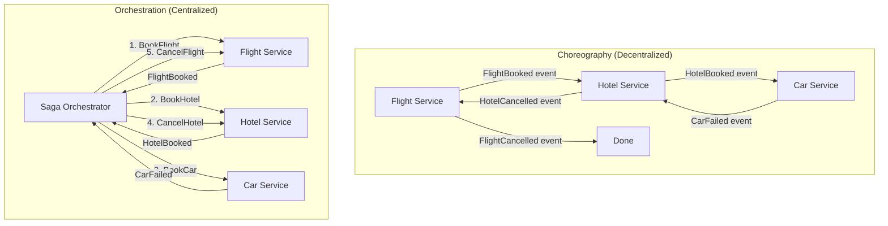
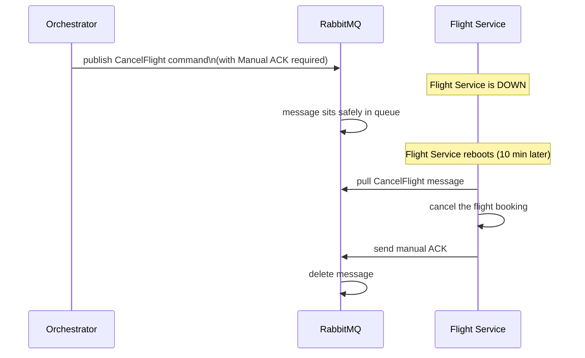

### **Week 4: Resilience, Distributed Transactions & Security**

### **Day 22: Distributed Transactions (The Saga Pattern)**

A **Saga** is a sequence of local transactions. Each local transaction updates its own service's database and then publishes an event or message to trigger the next step. If any step fails, the saga executes **Compensating Transactions** — specific operations that undo the work done by all preceding steps.

#### **1. Compensating Transactions (The "Undo" Button)**

You cannot simply `DELETE` the database row. You write specific business logic to reverse each action:

| Forward Action | Compensating Action |
|---|---|
| `ChargeCreditCard($500)` | `RefundCreditCard($500)` |
| `AllocateSeat(12B)` | `ReleaseSeat(12B)` |
| `BookFlight()` | `CancelFlight()` |

#### **2. Two Ways to Build a Saga**

| | Choreography | Orchestration |
|---|---|---|
| **Control** | Decentralized — no boss | Centralized Orchestrator |
| **Pros** | Very fast, no single point of failure | Clear state machine, easy to trace failures |
| **Cons** | Confusing mess with 4+ steps; hard to debug | Orchestrator is a SPOF; tightly couples services |

---

### **Actionable Task for Today**

Research the open-source tools companies use to manage Orchestrator Sagas so you don't have to write retry and rollback logic from scratch:

- **[Temporal.io](https://temporal.io)** — Go-native, designed to manage distributed state machines and execute compensating transactions automatically.
- **[AWS Step Functions](https://aws.amazon.com/step-functions/)** — Managed orchestration using visual state machines.

---

### **Day 22 Revision Question**

The `Rental Car Service` fails. The Saga triggers a `CancelFlight` compensating command.

But what if the `Flight Service` is temporarily down at the exact moment the Saga tries to send `CancelFlight`? You cannot leave the user with a booked flight they don't want.

**What architectural guarantee must your Compensating Transactions have to ensure the system eventually cleans itself up?**

**Answer:**

You cannot rely on a synchronous HTTP call to execute a compensating transaction — if the service is down, the undo action is lost forever.

Instead, the Orchestrator drops the `CancelFlight` command into **RabbitMQ with Manual ACKs required**. If the Flight Service is down, the message sits safely in the queue. When it reboots, it pulls the message, cancels the flight, and issues the manual ACK.

This guarantees **At-Least-Once Delivery** for the cleanup process. And because we use At-Least-Once delivery, the `CancelFlight` function must be **idempotent** — calling it twice must produce the same result as calling it once.
