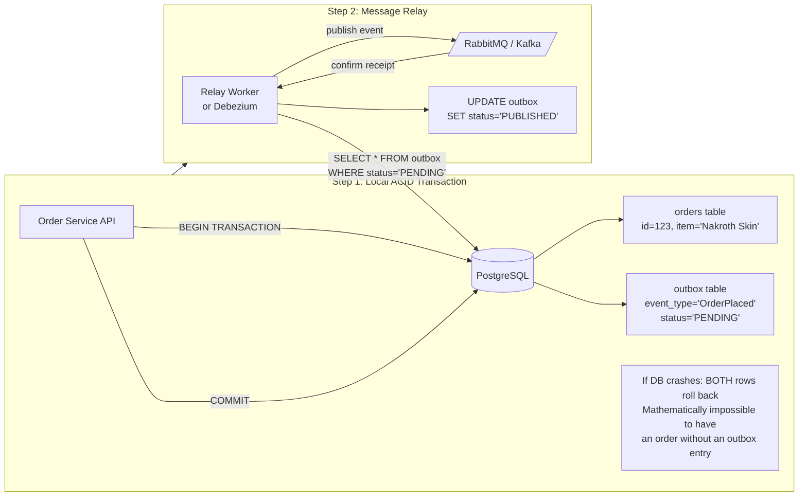
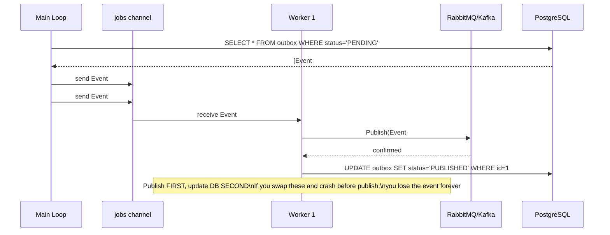

### **Day 23: The Transactional Outbox Pattern**

On Day 18, you identified this exact problem when you suggested writing to both Postgres and Kafka simultaneously. We called it the **Dual-Write Problem**. Today, we solve it.

#### **1. The Flawed Scenario**

Your `Order Service` needs to save a new order to PostgreSQL **and** publish an `OrderPlaced` event to RabbitMQ.

```go
// The Dual-Write Nightmare
db.Exec("INSERT INTO orders (item) VALUES ('Nakroth Skin')")
rabbitMQ.Publish("OrderPlaced")
```

If the database insert succeeds but the network drops before `rabbitMQ.Publish` fires — you have an order in the database, but the Inventory Service never heard about it. Stock is never deducted. Data is corrupted.

#### **2. The Solution: The Outbox Pattern**

We rely on the one thing we can mathematically trust: a **local, single-database ACID transaction**.



**Step 1: The Local Transaction**

```sql
BEGIN TRANSACTION;
  INSERT INTO orders (id, item) VALUES (123, 'Nakroth Skin');
  INSERT INTO outbox (event_type, payload, status) VALUES ('OrderPlaced', '{"id": 123}', 'PENDING');
COMMIT;
```

If the database crashes halfway through, _both_ inserts roll back. It is mathematically impossible to have an order without a matching outbox event.

**Step 2: The Message Relay**

A small background worker (or industry tool like **Debezium**) does one thing:
1. Poll: `SELECT * FROM outbox WHERE status = 'PENDING'`
2. Publish the event to RabbitMQ or Kafka.
3. On broker confirmation: `UPDATE outbox SET status = 'PUBLISHED' WHERE id = ...`

You have decoupled your database write from your network publish.

---

### **Actionable Task for Today**

Write the Go pseudo-code for the **Message Relay** worker. Think carefully about the order of operations.

**Answer: Go Channel Worker Pool**

Using a channel-based worker pool is the idiomatic Go way to build this relay. A single `for` loop is too slow; fanning out to Goroutines makes it lightning fast.

```go
package main

import (
	"log"
	"time"
)

type OutboxEvent struct {
	ID      int
	Payload string
}

func main() {
	// 1. Buffered channel to hold pending events
	jobs := make(chan OutboxEvent, 100)

	// 2. Spin up 5 concurrent workers
	for w := 1; w <= 5; w++ {
		go outboxWorker(w, jobs)
	}

	// 3. Infinite polling loop
	for {
		// Step A: Read PENDING rows from the database
		// SELECT * FROM outbox WHERE status = 'PENDING' LIMIT 50
		events := db.GetPendingEvents()

		// Step B: Push to workers
		for _, event := range events {
			// Optional but smart: update to 'PROCESSING' here so multiple
			// instances of this program don't grab the same rows
			jobs <- event
		}

		// Prevent hammering the database CPU
		time.Sleep(1 * time.Second)
	}
}

// 4. The Worker Function
func outboxWorker(id int, jobs <-chan OutboxEvent) {
	for event := range jobs {
		log.Printf("Worker %d processing event %d\n", id, event.ID)

		// Step C: Publish to the broker FIRST
		err := broker.Publish(event.Payload)

		if err != nil {
			// If network fails, do NOT update the database.
			// The main loop will pick this row up again on the next poll.
			log.Printf("Worker %d failed to publish: %v\n", id, err)
			continue
		}

		// Step D: Mark as done ONLY after confirmed publish
		// UPDATE outbox SET status = 'PUBLISHED' WHERE id = event.ID
		db.MarkAsPublished(event.ID)
	}
}
```



> **Critical Order of Operations:** Publish to the broker _first_, then update the database status _second_. If you reverse this and the worker crashes after updating the DB but before publishing, you silently lose the event. If it crashes after publishing but before updating the DB — the relay will just re-publish it (a harmless duplicate that downstream consumers handle via idempotency).

---

### **Day 23 Revision Question**

The relay reads a `PENDING` row, successfully publishes to RabbitMQ, but crashes right before updating the status to `PUBLISHED`. When the worker reboots, it sees the row still as `PENDING` and publishes again — a duplicate message.

**Because the Outbox Pattern fundamentally causes this scenario, what strict rule must all downstream Consumer services enforce?**

**Answer:** **Idempotency.** The Outbox Pattern guarantees _At-Least-Once_ delivery by design. Because the status update and the publish can never be atomic across two separate systems, duplicates are inevitable. Every downstream consumer must be idempotent — processing the same event twice must produce the same result as processing it once. Use the Unique Constraint + State Machine pattern from Day 13.
