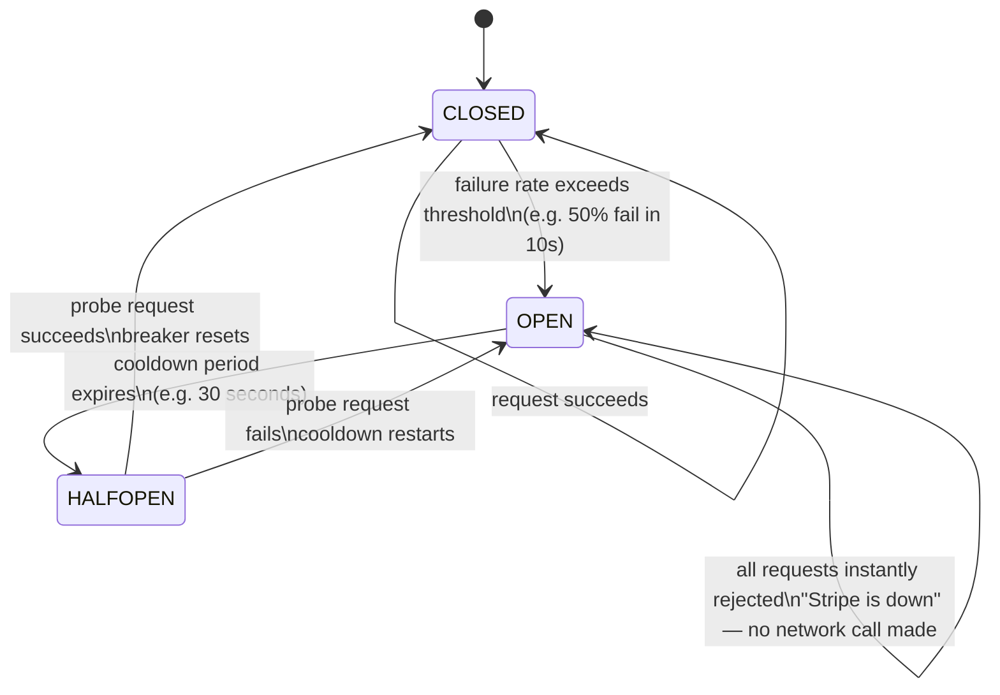
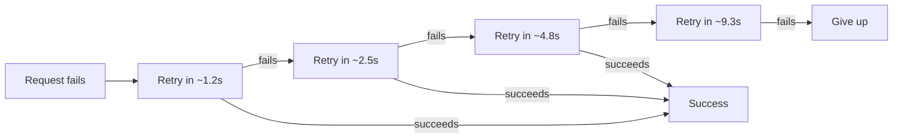
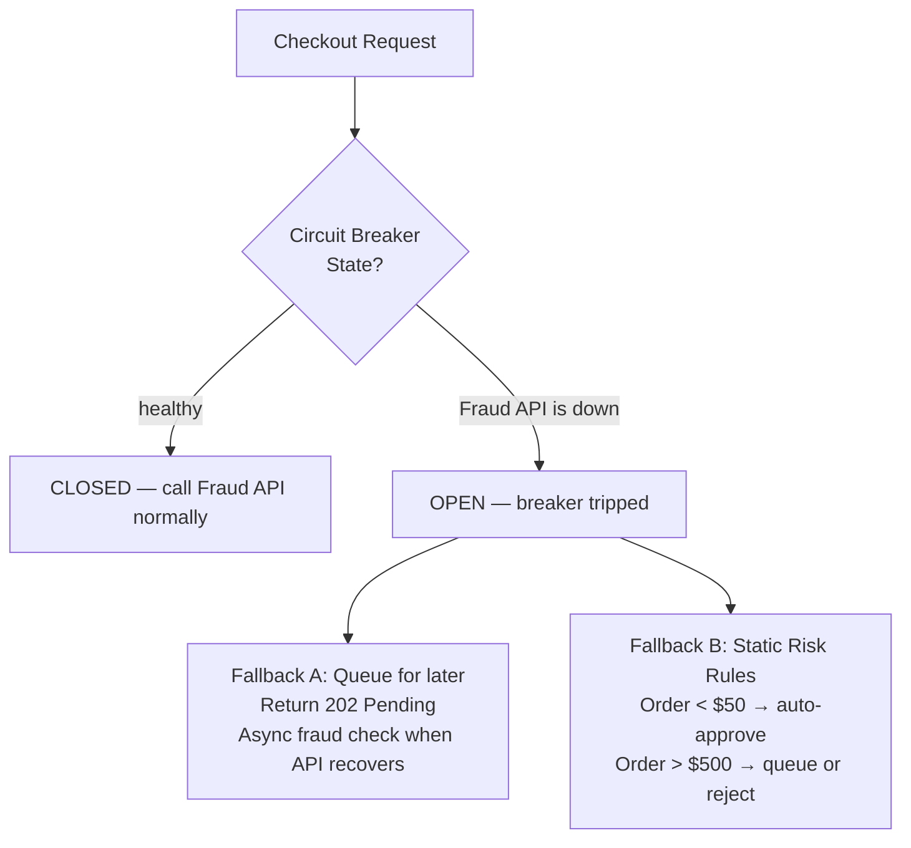

### **Day 24: Fault Tolerance (Circuit Breakers & Retries)**

For the past two weeks we solved problems with queues and events. But in the real world, you can't always be asynchronous. Sometimes your `Checkout Service` absolutely _must_ make a synchronous HTTP call to Stripe to charge a credit card.

What happens if Stripe's API goes down?

#### **1. The Problem: Cascading Failures**

If Stripe is down and your `Checkout Service` waits 10 seconds per timeout, 10,000 concurrent users will spawn 10,000 Goroutines — all waiting 10 seconds. Your server runs out of memory and crashes. Even worse, when Stripe comes back online, your servers hammer it with 10,000 retries simultaneously — crashing it again. This is a **Retry Storm**.

#### **2. The Solution: The Circuit Breaker Pattern**

Borrowed from electrical engineering — a proxy wrapper around your HTTP calls that protects the system.

- **CLOSED (Green Light):** Everything is healthy. Requests flow through normally. The breaker counts failures.
- **OPEN (Red Light):** Failure threshold crossed. The breaker instantly blocks all new requests and returns an error — no network call is made. This saves CPU/Memory and gives Stripe time to recover.
- **HALF-OPEN (Yellow Light):** After the cooldown, exactly _one_ probe request is let through. If it succeeds → CLOSED. If it fails → OPEN again.

#### **3. Adding Retries with Exponential Backoff + Jitter**

When the circuit is CLOSED, transient network blips still happen. Retry failed requests — but do it politely.

- **Bad:** Retry instantly → fail → retry instantly → fail. (DDoS your own dependency.)
- **Good (Exponential Backoff):** Retry in 1s → 2s → 4s → 8s → give up. Each delay doubles.
- **Pro-tip — Jitter:** Always add randomness. If 10,000 servers all retry at exactly 2.0s, they will collectively DDoS the target. Adding jitter (e.g., retry in 1.2s, then 2.5s) spreads the load.

---

### **Actionable Task for Today**

In Go, the industry-standard library is **`sony/gobreaker`**. Read the GitHub README for [`sony/gobreaker`](https://github.com/sony/gobreaker). Look at how you define the rules (`MaxRequests`, `Interval`, `Timeout`) and then wrap your `http.Get()` call inside an `Execute()` block.

---

### **Day 24 Revision Question**

When a Circuit Breaker trips to OPEN, your Checkout Service instantly fails fast — it refuses to call the `Fraud Detection API`. You now have a choice.

**Should you return a hard HTTP 500 Error to the user, or is there a better pattern you could implement when the breaker is open?**

**Answer: Graceful Degradation (Fallbacks)**

Instead of failing the user's checkout entirely, you **gracefully degrade**:

1. **Async Queue Fallback:** Tell the frontend "Pending." Place the order in a queue. When the Fraud API recovers, a background worker drains the queue, runs the checks, and releases the orders.

2. **Static Risk Threshold Fallback:** If the Fraud API is down, the code says: _"If the order is under $50, auto-approve it and take the risk. If it's over $500, queue it or reject it."_

Both approaches serve the user a meaningful response instead of a cryptic 500 error — and they protect your system from a thundering herd when the Fraud API comes back online.
