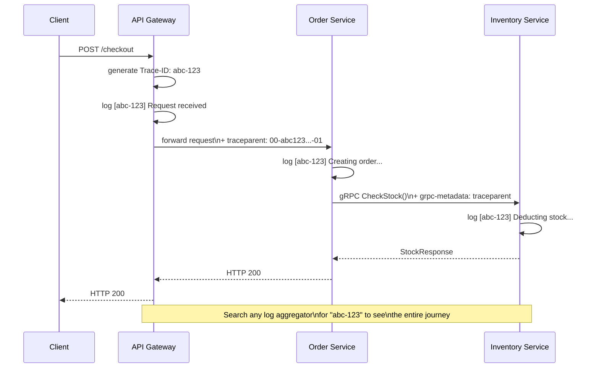

### **Day 25: Observability & Distributed Tracing**

In a monolith, if an error happens, you open `app.log`, scroll down, and read the stack trace. In microservices, a single user clicking "Checkout" might trigger the API Gateway, the Order Service, the Inventory Service, and a RabbitMQ worker. If checkout fails — which of those 4 servers threw the error? Searching through 4 different log files on 4 different machines simultaneously is impossible.

#### **1. The Solution: Distributed Tracing**

The industry standard protocol is **OpenTelemetry** (which replaced older tools like OpenTracing). Popular visualization tools include **Jaeger** and **Zipkin**.

#### **2. Trace IDs (The Correlation ID)**



- When a request hits the **API Gateway**, it generates a unique UUID called the **Trace ID** (e.g., `Trace-abc-123`).
- Every service logs with that Trace ID: `[abc-123] Creating order...`
- The Trace ID is passed downstream in HTTP headers (`traceparent`) or gRPC metadata.

Now you can open your centralized logging tool (Datadog, Splunk, Elastic), type in `abc-123`, and see the exact journey of that specific request across every service in your entire architecture.

#### **3. Span IDs**

A **Trace** represents the entire journey. A **Span** represents a single step within that journey.

```gantt
    title Trace abc-123 — Checkout Request (215ms total)
    dateFormat  X
    axisFormat  %Lms

    section API Gateway
    Routing             :0, 5

    section Order Service
    Business Logic      :5, 15

    section Inventory Service
    DB Query (SLOW!)    :15, 215
```

When you open Jaeger, it draws a Gantt chart like this. You can instantly see: _"The whole request took 215ms, and 200ms of that was the Inventory Service's database query."_

---

### **Actionable Task for Today**

You don't need to instrument OpenTelemetry today, but understand how Trace IDs flow inside a Go service.

In Go, we use `context.Context` to carry the Trace ID from function to function within a single service. Every function should accept `ctx context.Context` as its first parameter so it can log the Trace ID:

```go
func createOrder(ctx context.Context, item string) error {
    traceID := getTraceFromContext(ctx)
    log.Printf("[%s] Creating order for item: %s", traceID, item)
    // pass ctx downstream to every function call
    return deductInventory(ctx, item)
}
```

Look up **Jaeger Tracing** on their website to see what a live "Waterfall Trace" looks like — visualizing it makes the concept click instantly.

---

### **Day 25 Revision Question**

Inside Go we use `context.Context` to pass the Trace ID from function to function. But when the Order Service (Go) makes a network call to the Inventory Service (Python), how does the Trace ID travel across the network so Python can pick it up and continue the chain?

**Answer:**

**1. Injecting into the Header:**
The Go OpenTelemetry library reads the Trace ID from `context.Context` and automatically injects it into a standard HTTP header:

```
traceparent: 00-0af7651916cd43dd8448eb211c80319c-b7ad6b7169203331-01
```

For gRPC calls, it does the same thing — injecting into gRPC Metadata (which are HTTP/2 headers under the hood).

**2. The Python Mechanism:**
Python doesn't pass a `ctx` object to every function like Go does. The Python OpenTelemetry library uses a built-in feature called `contextvars` — a thread-local global variable. When the Python HTTP server receives the request, the library reads the `traceparent` header, saves it into `contextvars`, and every subsequent log or database call in that thread automatically knows its Trace ID — without you writing any extra code.

**This raises a painful realization:** If you have Go, Python, Java, and Node.js microservices, do you really want to write and maintain Circuit Breaker, Retries, and OpenTelemetry code in _four different programming languages_?

No. Which leads us to Day 26.
