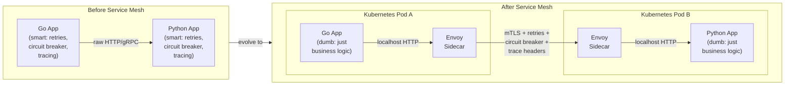

### **Day 26: Service Mesh Overview**

Today we abstract all that networking infrastructure away from your application code entirely.

#### **1. The Problem with "Smart Clients"**

Over the last 3 weeks, we made our `Order Service` very "smart." We added Go code for:

- gRPC dialing
- RabbitMQ connection management
- Circuit Breakers (`gobreaker`)
- Retries with exponential backoff
- Distributed Tracing injection

If you have 50 microservices across 4 different programming languages, keeping all those libraries updated and behaving identically is an absolute nightmare.

#### **2. The Solution: The Sidecar Proxy**

A Service Mesh (like **Istio** or **Linkerd**) solves this by stripping all networking code out of your application.

Instead of your Go app talking directly to the network, the Service Mesh automatically injects a tiny, lightning-fast proxy container (**Envoy**, written in C++) right next to your app container. This proxy is called a **Sidecar**.

#### **3. How the Sidecar Works**

1. Your `Order Service` goes back to being "dumb." It makes a standard local HTTP request to `http://inventory:8081`.
2. The Envoy Sidecar intercepts that outgoing request.
3. The Sidecar handles gRPC translation, Circuit Breaking, Retries, and Trace ID injection.
4. The Sidecar sends the request over the encrypted network.
5. On the receiving side, the Inventory Service's Sidecar intercepts the incoming request, validates mTLS, and passes it locally to the Python app.

**The Magic:** Your application code focuses 100% on business logic. The Service Mesh handles all networking resilience, completely language-agnostic.

---

### **Actionable Task for Today**

We won't install Istio locally (it requires a full Kubernetes cluster), but mentally model the Kubernetes Pod diagram above. Notice:

- Inside Pod A: Two containers — `Go App` and `Envoy`. They share a network namespace, so Envoy intercepts traffic on `localhost`.
- The inter-pod traffic is encrypted with mTLS (covered tomorrow).
- Your Go code never sees any of this complexity.

---

### **Day 26 Revision Question**

Before Service Mesh: `Go App → Network → Python App`
After Service Mesh: `Go App → Envoy → Network → Envoy → Python App`

**By forcing all traffic through two additional proxy hops, what is the most obvious, unavoidable architectural penalty?**

**Answer: Latency**

Latency is the tax you pay for using a Service Mesh.

Even though Envoy is written in highly optimized C++ and typically adds less than **1 millisecond** per hop, it is still non-zero. In a deeply nested architecture (Service A → B → C → D → E), you just added 10 extra proxy hops to a single user request.

For 99% of companies, trading 5 extra milliseconds for automated retries, circuit breaking, mTLS encryption, and distributed tracing across every language in your stack is the easiest decision in the world.

For **High-Frequency Trading firms** where single-digit microseconds matter, a Service Mesh is entirely out of the question.
