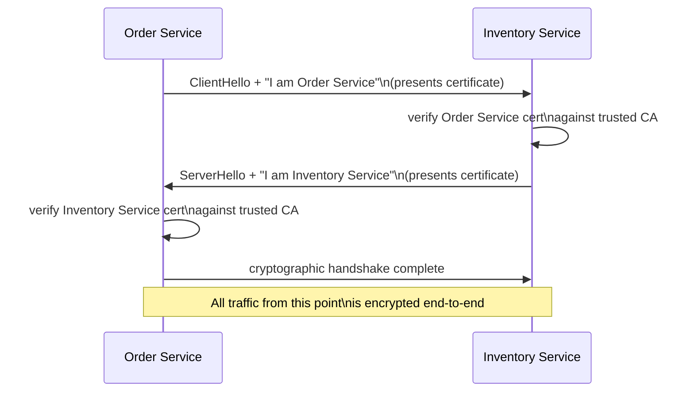
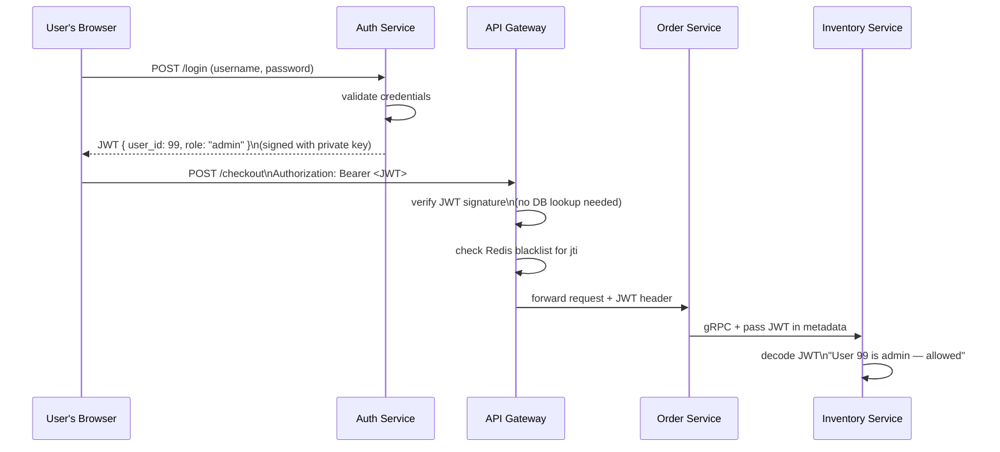
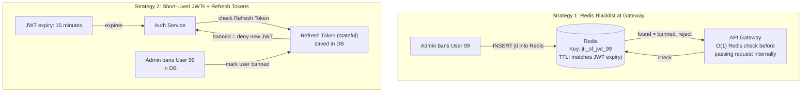

### **Day 27: Security in Transit (mTLS & JWTs)**

Until now, our microservices have been talking over **plaintext**. Anyone on the internal network could intercept those packets and read credit card numbers. Today we lock the system down.

#### **1. Mutual TLS (mTLS)**

Standard TLS: your browser connects to your bank, the bank's server presents a certificate proving who it is, and traffic is encrypted. The bank doesn't ask _your browser_ for a certificate — just a password.

In **Mutual TLS**, both sides verify each other with cryptographic certificates:

**The Nightmare:** Manually rotating thousands of TLS certificates every 30 days across hundreds of services is a DevOps disaster.

**The Savior:** The Service Mesh. With Istio, the Envoy sidecars **automatically generate, rotate, and validate** mTLS certificates in the background. Your Go app still sends plaintext to `localhost` — Envoy handles all the encryption transparently.

#### **2. Passing Identity (JWT)**

mTLS proves _which microservice_ is calling. But how does the Inventory Service know _which user_ clicked the button?

We use **JSON Web Tokens (JWT)**.

1. The user logs in. The Auth Service gives their browser a signed JWT: `{"user_id": 99, "role": "admin"}`.
2. The browser sends the JWT in the `Authorization` header to the API Gateway.
3. The Gateway validates the cryptographic signature. A fake token is rejected instantly — without a database query.
4. The validated JWT header is passed downstream to the Order Service, then to the Inventory Service.

Any microservice deep in the network can instantly decode the JWT and know the user's identity and role — without querying a central database.

---

### **Actionable Task for Today**

Open [jwt.io](https://jwt.io) in your browser and examine a JWT payload. Notice it is just Base64-encoded JSON — **anyone can decode and read it**. The security comes from the **Signature** at the bottom, which mathematically guarantees the data hasn't been tampered with.

In Go, look up the [`golang-jwt/jwt`](https://github.com/golang-jwt/jwt) library — the industry standard for parsing and validating JWTs in HTTP middleware.

---

### **Day 27 Revision Question**

JWTs are stateless — microservices validate them mathematically without a database. But imagine User 99 goes rogue and an admin clicks "BAN USER."

**If User 99's JWT doesn't expire for another 24 hours and your services validate it mathematically without checking the database, how do you stop them from using your system for the next 24 hours?**

**Answer: Two complementary strategies**

1. **API Gateway Redis Blacklist:** When User 99 is banned, drop their JWT ID (`jti`) into Redis with a TTL matching the token's expiry. The Gateway does a blazing-fast O(1) Redis check before every request. Internal microservices remain completely stateless — they never check a database.

2. **Short-Lived JWTs + Refresh Tokens:** Keep JWT expiry very short (e.g., 15 minutes). A banned user can cause trouble for at most 14 minutes and 59 seconds. To avoid forcing users to re-login every 15 minutes, the frontend uses a stateful **Refresh Token** (saved in the database). When the JWT expires, the frontend quietly asks the Auth Service for a new one. If the user is banned, the Auth Service denies the refresh request — locking them out permanently.
