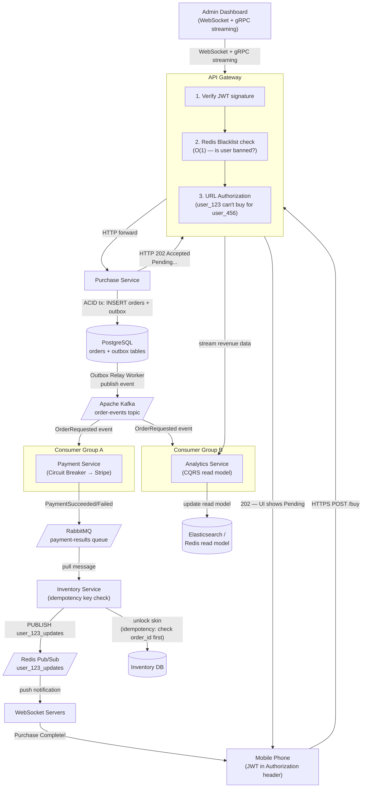
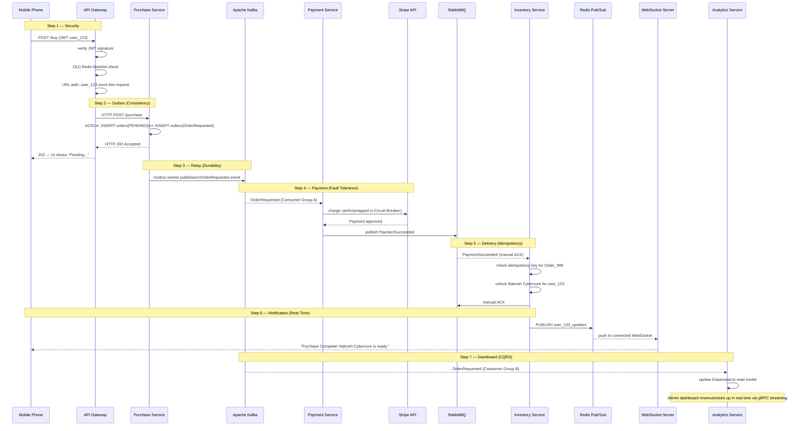

### **Day 28: The Final Architecture Review**

Today there is no new theory and no new code. Today is about proving to yourself that you can see the matrix.

Over the last 27 days, we have built a massive toolkit:

| Category | Tools & Patterns |
|---|---|
| **Sync** | HTTP/REST, gRPC, API Gateways |
| **Async** | RabbitMQ, Kafka, Pub/Sub, Fanouts |
| **Data Patterns** | CQRS, Event Sourcing, Outbox Pattern |
| **Resilience** | Idempotency, Sagas, Circuit Breakers, Retries |
| **Operations** | Distributed Tracing, Service Mesh, mTLS, JWTs |

---

### **The Final Boss Scenario**

You are the Lead Backend Architect for a massive mobile game.

Today is the launch of the highly anticipated **"Nakroth Cybercore" skin**. You are expecting 500,000 players to log in and attempt to purchase within the first 10 minutes.

**The business requirements:**

1. **Security:** Only authenticated, non-banned users can buy it.
2. **Speed:** The moment the user clicks "Buy," the UI must respond almost instantly — the app cannot freeze.
3. **Resilience:** If the 3rd-party Payment Gateway (Stripe/Apple Pay) goes down under load, we cannot lose a single order, and we cannot crash our own servers waiting for it.
4. **Consistency:** We absolutely cannot accidentally charge a user twice, even if the network stutters.
5. **Analytics:** The Data team needs a real-time, searchable dashboard showing exactly how much revenue is being generated every second.

---

### **My Architecture Design**

#### **The Master Blueprint**

#### **Key Design Decisions**

**UI Strategy — "Pending" (Not Optimistic)**
This skin costs real money. Optimistic UI is great for liking a tweet, but terrible for financial transactions. The user taps "Buy," the UI shows "Pending... check back in a moment," and they jump back into a match. When the purchase completes, a WebSocket push notifies them in real time.

**Gateway Authorization — Two Layers**
1. **JWT validation:** The Gateway verifies the cryptographic signature. No database query needed — mathematically instant.
2. **URL-level authorization:** The Gateway checks that `user_123` isn't trying to trigger a purchase on behalf of `user_456` by inspecting the URL parameters. Malicious requests are blocked before they ever touch the internal network.

**Entry Point — HTTP, Not Direct-to-Kafka**
The Gateway calls the Purchase Service synchronously via HTTP. The Purchase Service generates `Order_999`, writes both the order row and an outbox event in a single ACID transaction, and returns **HTTP 202 Accepted** to the Gateway. _Then_ the Outbox Relay Worker safely publishes to Kafka.

> Why not `Gateway → Kafka → Purchase Service`? Because if the Gateway dumps straight to Kafka, it cannot get the `Order_ID` back to tell the frontend what to track.

**Kafka as the Event Backbone**
After the HTTP 202 is returned, the Outbox Relay publishes `OrderRequested` to Kafka. Two independent consumer groups consume this event simultaneously without interfering with each other:
- **Consumer Group A (Payment Service):** Wraps its Stripe call in a Circuit Breaker. If Stripe is struggling, the breaker trips to OPEN and the order falls back to a retry queue — no server crashes, no lost orders.
- **Consumer Group B (Analytics Service):** Reads the same Kafka event stream to build its CQRS read model independently — no polling the Purchase database needed.

**Payment → Inventory via RabbitMQ**
Once the Payment Service confirms success, it publishes to a targeted RabbitMQ queue. The Inventory Service pulls this with Manual ACKs — on crash, the message stays in the queue and will be retried. The very first thing the Inventory Service does is check its idempotency table for `Order_999`. If it has been seen before, it ACKs and skips. If not, it unlocks the skin, saves the idempotency key, and ACKs.

**Real-Time Notification — Redis Pub/Sub**
The Inventory Service fires a Redis Pub/Sub message to `user_123_updates`. All 5 WebSocket Server instances hear it instantly, but only the one holding the TCP connection for `user_123` pushes the notification to the player's phone: _"Purchase Complete! Nakroth Cybercore is ready to equip."_

**Analytics Dashboard — gRPC Streaming**
The Lead Admin's dashboard holds an open WebSocket connection through the Gateway, backed by gRPC streaming to the Analytics Service. The Analytics Service consumes the Kafka event stream and updates an Elasticsearch/Redis read model in real time — revenue numbers tick up flawlessly on screen with no separate polling.

---

### **The Full Story: Launching Nakroth Cybercore**

---

### **System Architecture: Conquered**

Take a moment to look at what you just built.

You handled **load**, **security**, **dual-write prevention**, **network failures**, **data consistency**, and **real-time observability** — simultaneously, at 500,000 concurrent users, without losing a single order.

You didn't just string together APIs. You engineered a highly resilient, enterprise-grade distributed system from first principles.

**The architecture is yours. What do you want to build next?**
