# Learn Microservice Communication

A 28-day sprint covering how distributed services talk to each other — synchronously, asynchronously, and everything in between. Each week pairs hands-on Go code with a deep, low-level intro README so you understand what is actually happening on the wire, inside the brokers, and in the failure modes.

---

## How this repo is organized

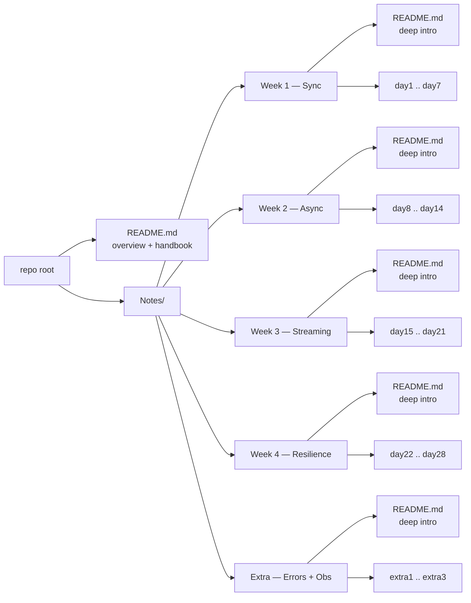

Every folder under `Notes/` has the same shape: one **deep-intro `README.md`** plus the daily lesson files. Read the intro first — it gives you the protocol, internals, and mental models. Then the day notes drill into specifics.

| Folder | Deep intro covers |
|--------|-------------------|
| [Week 1 — Sync](Notes/Week1-Fundamentals_and_Synchronous_communication/README.md) | TCP, TLS 1.3, HTTP/1.1 vs HTTP/2 framing, gRPC, Protobuf wire format |
| [Week 2 — Async](Notes/Week2-Asynchronous_Communication_And_Message_Queues/README.md) | AMQP 0-9-1 frames, RabbitMQ internals, SQS/SNS envelopes, delivery guarantees |
| [Week 3 — Streaming](Notes/Week3-Event_Streaming_and_Advanced_Patterns/README.md) | Kafka record batches, segments + indexes, ISR, consumer rebalance, CQRS, ES |
| [Week 4 — Resilience](Notes/Week4-Resilience_and_Distributed_transactions_and_Security/README.md) | Saga, outbox + CDC, circuit breaker, `traceparent`, mTLS, sidecar data path |
| [Extra — Errors + Obs](Notes/Extra-Error_Handling_and_Observability/README.md) | Three-layer error model, gRPC status, `%w` chains, three pillars |

---

## Stack

- **Language:** Go
- **Brokers:** RabbitMQ, Apache Kafka, Redis Pub/Sub
- **Infrastructure:** Docker Compose, LocalStack (AWS SQS/SNS)
- **Patterns:** Outbox, Saga, CQRS, Event Sourcing, Circuit Breaker

---

## The communication stack, layer by layer

Every line of code in this repo eventually becomes bytes on a NIC. Here is the layer cake the curriculum touches, mapped to where each topic lives:

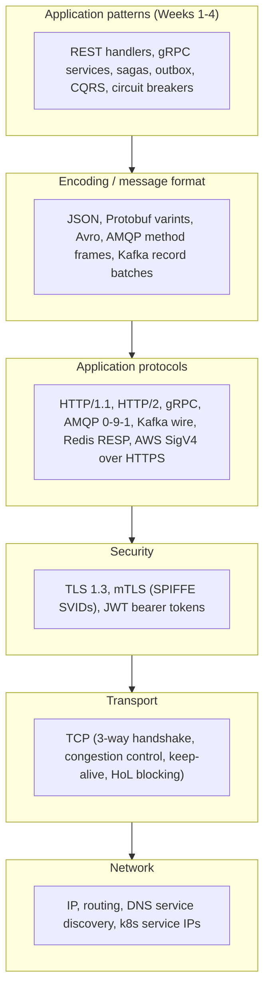

A 200-byte JSON request becomes ~1 KB on the wire after framing, TLS, IP, and Ethernet headers. A small gRPC Protobuf request can be ~120 bytes total. Multiply by your RPS and you see why protocol choice is not cosmetic.

---

## Two axes of every design choice

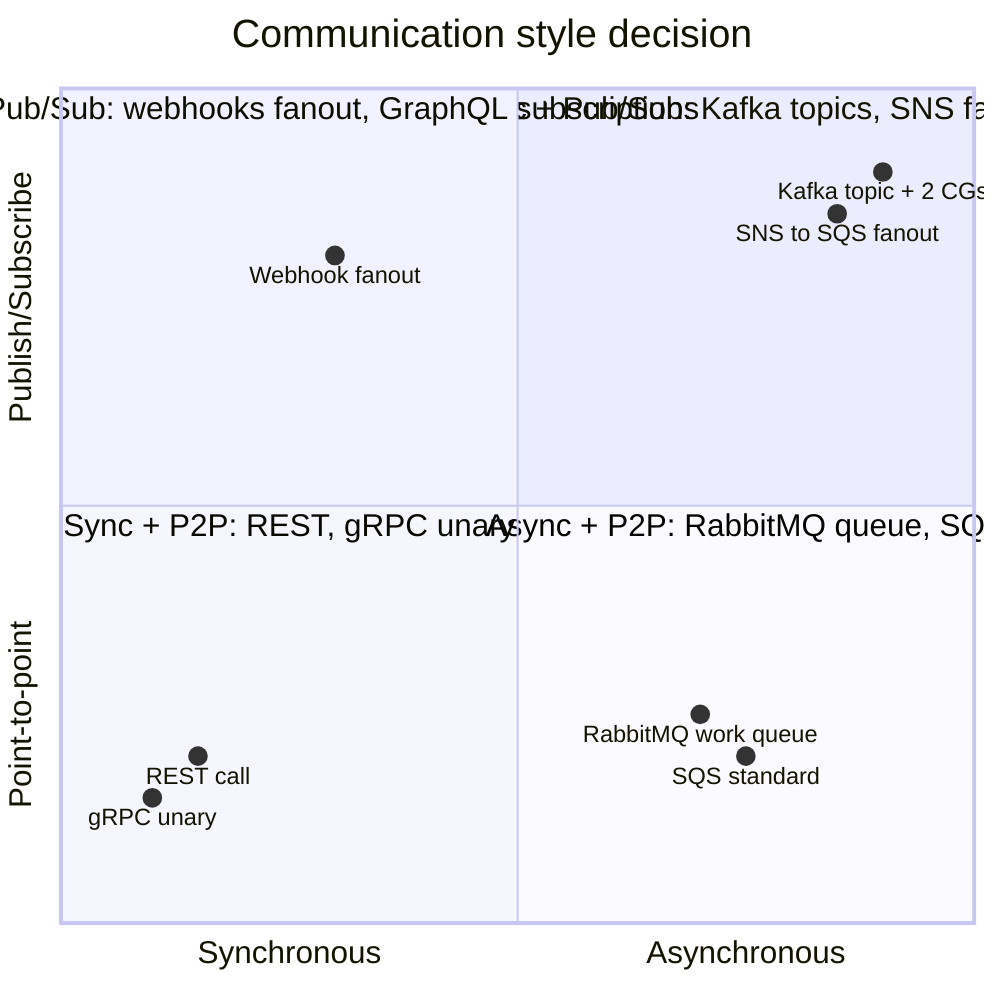

- **Sync + P2P** = strongest coupling, simplest mental model. Use for the request hot path where the user is waiting.
- **Async + P2P** = work queues. Use to absorb load and decouple producer from consumer pace.
- **Async + Pub/Sub** = decoupled fanout. Use when many subsystems care about the same fact happening.
- **Sync + Pub/Sub** = fragile in practice — fanout to N callees inside a single request multiplies failure surface (see tail-latency math in Week 1).

---

## Four-week curriculum map

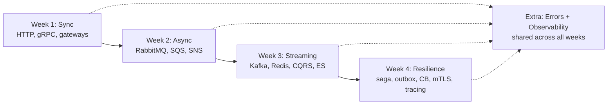

Each week strictly builds on the last. Week 2 fixes Week 1's tight coupling. Week 3 fixes Week 2's "queue forgets after ack". Week 4 fixes everything that can still go wrong in production.

---

## Week 1 — Synchronous Communication

_How services call each other directly and wait for a response._

[Week 1 deep intro README](Notes/Week1-Fundamentals_and_Synchronous_communication/README.md)

| Day | Topic |
|-----|-------|
| [Day 1](Notes/Week1-Fundamentals_and_Synchronous_communication/day1-microservices_paradigm.md) | The Microservices Paradigm & The 8 Fallacies of Distributed Computing |
| [Day 2](Notes/Week1-Fundamentals_and_Synchronous_communication/day2-sync_vs_async.md) | Sync vs. Async — trade-offs and when to use each |
| [Day 3](Notes/Week1-Fundamentals_and_Synchronous_communication/day3-RESTful.md) | RESTful HTTP — building two services that talk over JSON |
| [Day 4](Notes/Week1-Fundamentals_and_Synchronous_communication/day4-RPC_and_gRPC.md) | RPC & gRPC — why binary Protobuf over HTTP/2 beats REST internally |
| [Day 5](Notes/Week1-Fundamentals_and_Synchronous_communication/day5-implementing_gRPC.md) | Implementing gRPC in Go — `.proto` contracts, timeouts, context propagation |
| [Day 6](Notes/Week1-Fundamentals_and_Synchronous_communication/day6-api_gateway.md) | API Gateways — the single entry point: routing, auth, rate limiting |
| [Day 7](Notes/Week1-Fundamentals_and_Synchronous_communication/day7-consolidation_project.md) | Project: Gateway → Order Service (HTTP) → Inventory Service (gRPC) |

---

## Week 2 — Asynchronous Communication & Message Queues

_How services communicate without waiting for each other._

[Week 2 deep intro README](Notes/Week2-Asynchronous_Communication_And_Message_Queues/README.md)

| Day | Topic |
|-----|-------|
| [Day 8](Notes/Week2-Asynchronous_Communication_And_Message_Queues/day8-EDA.md) | Event-Driven Architecture — commands vs. events, temporal decoupling |
| [Day 9](Notes/Week2-Asynchronous_Communication_And_Message_Queues/day9-messages_queues_and_brokers.md) | Message Brokers — point-to-point queues vs. publish/subscribe |
| [Day 10](Notes/Week2-Asynchronous_Communication_And_Message_Queues/day10-RabbitMQ_basics.md) | RabbitMQ Basics — AMQP, producers, consumers, manual ACKs |
| [Day 11](Notes/Week2-Asynchronous_Communication_And_Message_Queues/day11-advanced_routing.md) | Exchanges & Routing — Fanout, Direct, Topic exchange types |
| [Day 12](Notes/Week2-Asynchronous_Communication_And_Message_Queues/day12-cloud_native_queues.md) | Cloud Queues — AWS SQS, SNS, and the SNS-to-SQS fanout pattern |
| [Day 13](Notes/Week2-Asynchronous_Communication_And_Message_Queues/day13-message_delivery_and_idempotency.md) | Delivery Guarantees — at-most-once, at-least-once, exactly-once, idempotency |
| [Day 14](Notes/Week2-Asynchronous_Communication_And_Message_Queues/day14-consolidation_project.md) | Project: Order Service publishes to RabbitMQ, Inventory Service consumes |

---

## Week 3 — Event Streaming & Advanced Patterns

_High-throughput streaming and separating reads from writes._

[Week 3 deep intro README](Notes/Week3-Event_Streaming_and_Advanced_Patterns/README.md)

| Day | Topic |
|-----|-------|
| [Day 15](Notes/Week3-Event_Streaming_and_Advanced_Patterns/day15-queues_vs_event_streams.md) | Queues vs. Streams — why Kafka's append-only log changes everything |
| [Day 16](Notes/Week3-Event_Streaming_and_Advanced_Patterns/day16-Apache_Kafka_fundamentals.md) | Kafka Fundamentals — topics, partitions, offsets, consumer groups |
| [Day 17](Notes/Week3-Event_Streaming_and_Advanced_Patterns/day17-Kafka_in_practice.md) | Kafka in Go — keyed messages, partition assignment, ordering guarantees |
| [Day 18](Notes/Week3-Event_Streaming_and_Advanced_Patterns/day18-Redis_PubSub.md) | Redis Pub/Sub — ephemeral messaging and the WebSocket notification pattern |
| [Day 19](Notes/Week3-Event_Streaming_and_Advanced_Patterns/day19-CQRS.md) | CQRS — separate write databases from read databases, synced by events |
| [Day 20](Notes/Week3-Event_Streaming_and_Advanced_Patterns/day20-event_sourcing.md) | Event Sourcing — store events not state; replay to rebuild history |
| [Day 21](Notes/Week3-Event_Streaming_and_Advanced_Patterns/day21-consolidation_challenge.md) | Project: Command API writes to Kafka; Query Service builds a read model |

---

## Week 4 — Resilience, Transactions & Security

_Keeping communication reliable and safe when things go wrong._

[Week 4 deep intro README](Notes/Week4-Resilience_and_Distributed_transactions_and_Security/README.md)

| Day | Topic |
|-----|-------|
| [Day 22](Notes/Week4-Resilience_and_Distributed_transactions_and_Security/day22-Saga_pattern.md) | The Saga Pattern — distributed rollbacks via choreography or orchestration |
| [Day 23](Notes/Week4-Resilience_and_Distributed_transactions_and_Security/day23-Transactional_Outbox_pattern.md) | The Outbox Pattern — atomically save to DB and publish to a broker |
| [Day 24](Notes/Week4-Resilience_and_Distributed_transactions_and_Security/day24-Circuit_Breakers_and_retries.md) | Circuit Breakers & Retries — fail fast, recover gracefully |
| [Day 25](Notes/Week4-Resilience_and_Distributed_transactions_and_Security/day25-observability_and_distributed_tracing.md) | Distributed Tracing — follow one request across many services with Trace IDs |
| [Day 26](Notes/Week4-Resilience_and_Distributed_transactions_and_Security/day26-service_mesh_overview.md) | Service Mesh — move retries, circuit breaking, and tracing out of your code |
| [Day 27](Notes/Week4-Resilience_and_Distributed_transactions_and_Security/day27-mTLS_and_JWTs.md) | mTLS & JWTs — encrypt service-to-service traffic and propagate user identity |
| [Day 28](Notes/Week4-Resilience_and_Distributed_transactions_and_Security/day28-the_final_architecture_review.md) | Final Review — full end-to-end architecture for a high-load purchase flow |

---

## Extra — Error Handling & Observability

_How services communicate failures clearly — to clients, to other services, and to engineers debugging at 2am._

[Extra deep intro README](Notes/Extra-Error_Handling_and_Observability/README.md)

| | Topic |
|---|---|
| [Extra 1](Notes/Extra-Error_Handling_and_Observability/extra1-error_classification_and_propagation.md) | Error Classification — business errors vs infrastructure errors, and which layer owns each |
| [Extra 2](Notes/Extra-Error_Handling_and_Observability/extra2-structured_logging_with_trace_ids.md) | Structured Logging — log levels, Trace ID injection, what each layer logs and what it must not |
| [Extra 3](Notes/Extra-Error_Handling_and_Observability/extra3-go_error_patterns.md) | Go Error Patterns — typed sentinels, `%w` wrapping chains, three-layer handler, Trace middleware |

---

## Core mental models — cheatsheet

The mental models below repeat across every week. Memorize them; the patterns are easy to look up later.

### CAP and PACELC

- **CAP**: under a network **P**artition you must choose between **C**onsistency and **A**vailability.
- **PACELC**: even when there is no partition, you choose between **L**atency and **C**onsistency. Most modern systems are AP+EL by default (e.g. eventually consistent read replicas).

### Delivery guarantees

| Guarantee          | Producer side                       | Consumer side                         | Achievability        |
|--------------------|-------------------------------------|---------------------------------------|----------------------|
| At-most-once       | send and forget                     | no retries                            | trivial              |
| At-least-once      | retry until ack                     | may receive duplicates                | default everywhere   |
| Exactly-once       | n/a in practice                     | n/a in practice                       | only "effectively-once" via idempotent consumers |

### Ordering

- HTTP/REST: no ordering guarantee across requests.
- gRPC stream: ordered within one stream.
- RabbitMQ: ordered within a queue, single consumer; not ordered with multiple consumers.
- Kafka: ordered within a partition; choose the partition by key to keep "per entity" ordering.

### Idempotency

- A request is idempotent when applying it N times has the same effect as applying it once.
- Implemented via `Idempotency-Key` headers, `INSERT ... ON CONFLICT DO NOTHING`, version columns with CAS, or natural keys.

### Backpressure

- Sync: implicit — caller blocks waiting for callee.
- Queue-based: explicit — producer can be slowed via flow control, queue depth alarms, or quotas.
- Streaming (Kafka): consumer pulls at its own pace. The lag itself is the backpressure signal.

### Failure domains

- A failure domain is the largest blast radius of a single fault. A node, an AZ, a region, a single dependency.
- Aim for **failures contained to one domain at a time**. Cross-AZ replicas, per-dependency circuit breakers, bulkheaded thread/connection pools.

---

## Handbook appendix — diagram-first deep dives

Short references you can flip to when you forget a wire format.

### A1. TCP + TLS handshake — what happens before your first HTTP byte

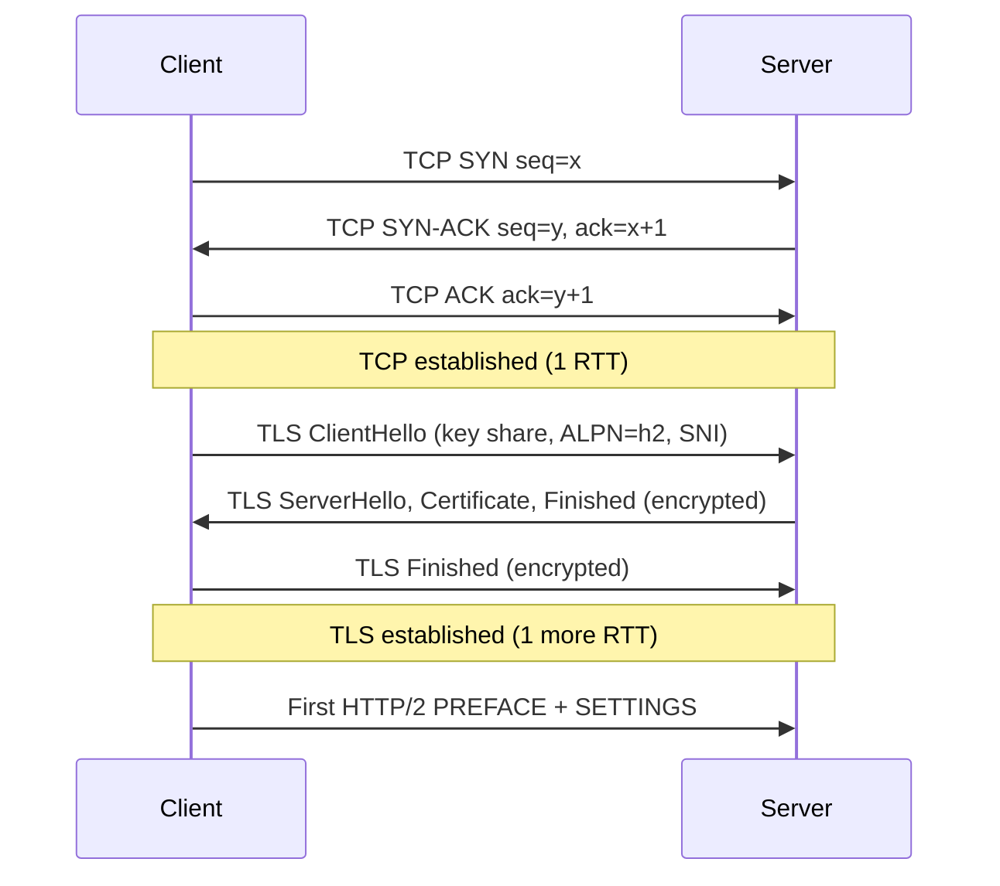

A cold cross-region call already costs 2 RTT before any HTTP byte. This is why connection reuse and HTTP/2 multiplexing matter.

### A2. HTTP/1.1 vs HTTP/2 framing

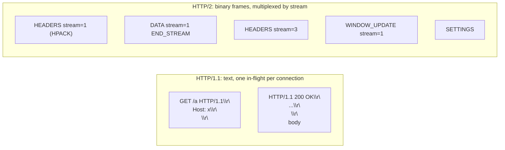

HTTP/2 frame layout: `length(24b) | type(8b) | flags(8b) | R(1b) | streamID(31b) | payload`. Frame types include `HEADERS`, `DATA`, `SETTINGS`, `WINDOW_UPDATE`, `PING`, `GOAWAY`, `RST_STREAM`.

### A3. gRPC on top of HTTP/2

```text
:method = POST
:path   = /inventory.InventoryService/Reserve
content-type = application/grpc+proto
te = trailers
grpc-timeout = 250m

DATA frame body:
| 1B compressed-flag | 4B big-endian length | N bytes Protobuf payload |

trailers:
grpc-status: 0
grpc-message: OK
```

### A4. Protobuf wire format

Field tag = `(field_number << 3) | wire_type`.

| wire_type | encoding         | Go types                                  |
|-----------|------------------|-------------------------------------------|
| 0         | varint           | int32, int64, bool, enum                  |
| 1         | 64-bit fixed     | fixed64, sfixed64, double                 |
| 2         | length-delimited | string, bytes, sub-message, packed repeated |
| 5         | 32-bit fixed     | fixed32, sfixed32, float                  |

Forward compatibility: unknown fields are skipped, never reused. This is why Protobuf services can be deployed independently across many services.

### A5. AMQP 0-9-1 routing

```mermaid
flowchart LR
    P[Producer] -->|"basic.publish exchange=ex routing-key=order.created"| Ex{{Exchange: ex (topic)}}
    Ex -->|"binding: order.*"| Q1[(Queue: inventory)]
    Ex -->|"binding: order.created"| Q2[(Queue: email)]
    Ex -->|"binding: #"| Q3[(Queue: audit)]
    Q1 --> C1[Consumer]
    Q2 --> C2[Consumer]
    Q3 --> C3[Consumer]
```

Frame types: `METHOD` (1), `CONTENT HEADER` (2), `CONTENT BODY` (3), `HEARTBEAT` (8). All end with `0xCE`.

### A6. Kafka on-disk log

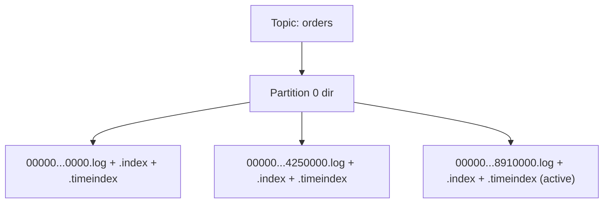

- Append-only, segmented files.
- Sparse `.index` maps `offset -> file position`; `.timeindex` maps `timestamp -> offset`.
- Reads use `sendfile(2)` for zero-copy from page cache to socket.

### A7. Redis event loop

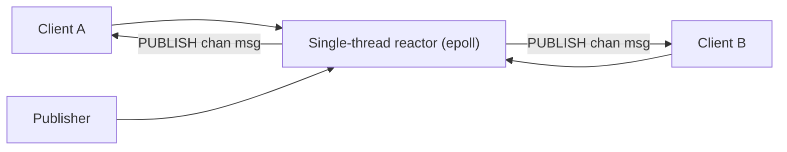

`PUBLISH` is fire-and-forget delivery to currently-connected subscribers. No persistence. For durable streaming on Redis, use Redis Streams.

### A8. Kafka consumer group rebalance

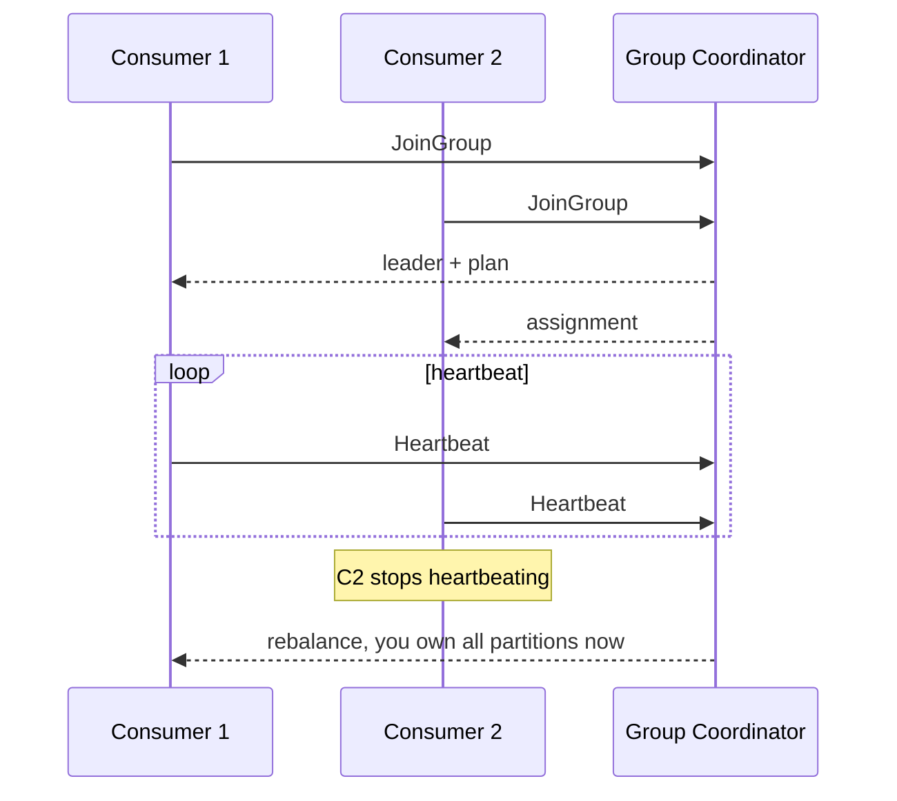

Modern clients use cooperative rebalancing (KIP-429): only the impacted partitions move.

### A9. Outbox + CDC

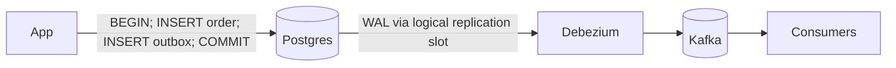

The DB transaction makes the dual-write atomic. The relay or CDC tool turns that into a stream of events without a 2-phase commit.

### A10. Saga: choreography vs orchestration

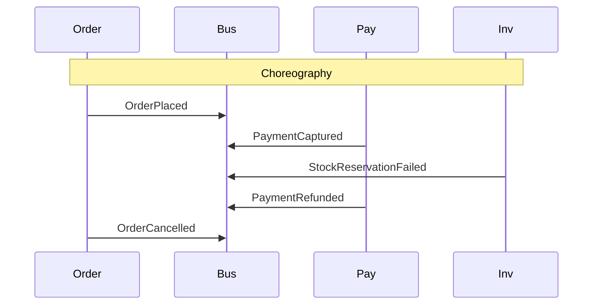

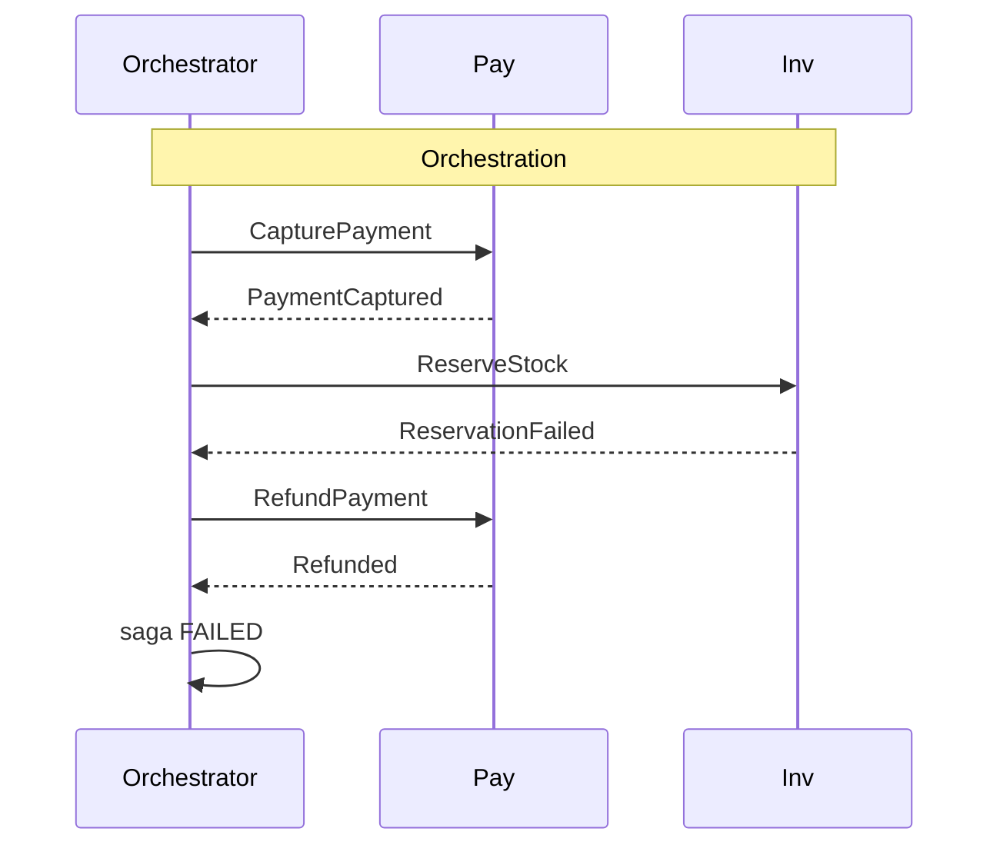

### A11. Circuit breaker state machine

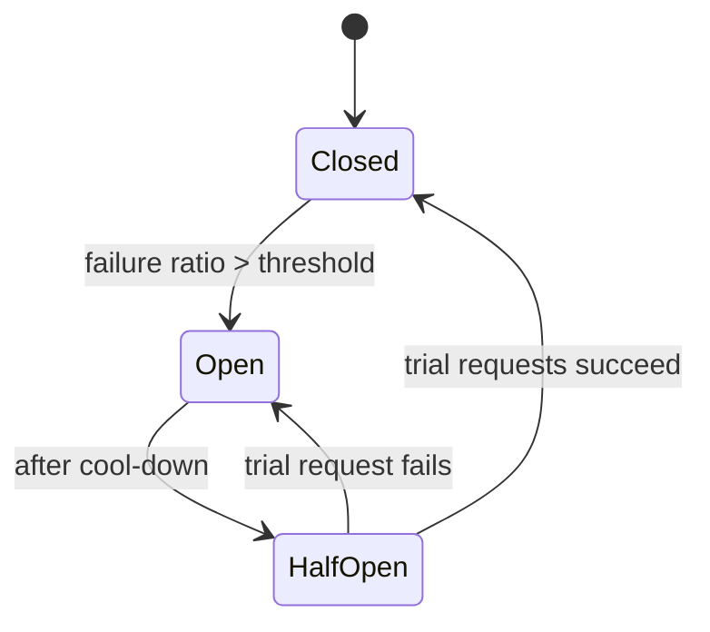

Counters: `total`, `failures`, `successes`, `slowCalls`, `rejected`, all over a rolling window.

### A12. Distributed tracing — `traceparent` and the span tree

```text
traceparent: 00-4bf92f3577b34da6a3ce929d0e0e4736-00f067aa0ba902b7-01
             ver  trace-id (16B)                  parent-id (8B)   flags
```

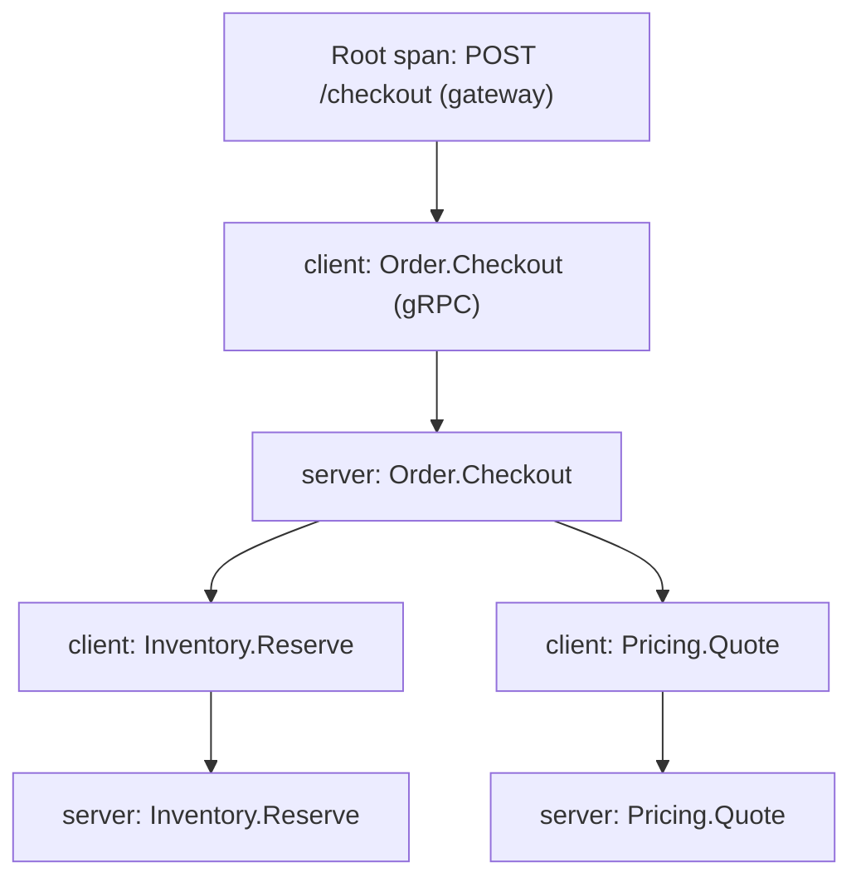

Each box is a span. All spans share the same trace ID. Each child carries the parent's span ID as its `parent-id`. That is how a tree gets reconstructed from independent service exports.

---

## How to read this repo

1. Skim this README's stack diagram, two-axes quadrant, and curriculum map.
2. For each week, read its **deep intro README** first.
3. Then go day-by-day. The day notes assume you have the mental models from the intro.
4. Use the handbook appendix as a quick reference when you forget a wire format or a state machine.
5. Read the **Extra** section in parallel with Week 4 — error handling and observability touch everything.

---

Focus on the **why** behind each pattern. The code is lookable — the mental models are what matter.
